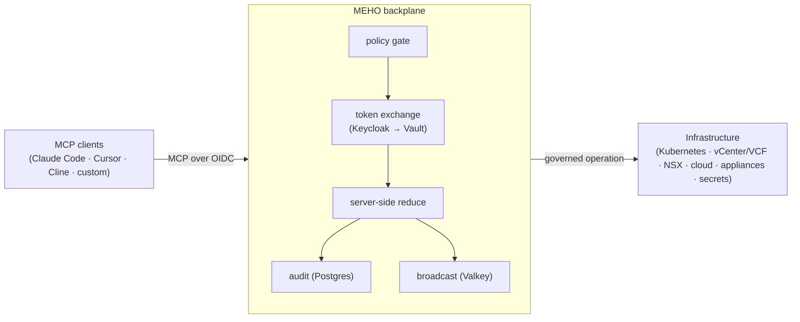

# MEHO

> Governance backplane for AI agents acting on infrastructure —
> policy-gated, audit-grade, MCP-native. Apache 2.0.

[](https://github.com/evoila/meho/releases)
[](https://github.com/evoila/meho/actions/workflows/ci.yml)
[](./LICENSE)
[](./CONTRIBUTING.md#public-from-day-1-deliberately)

**Status:** v0.9.0 released. The backplane image, Helm chart, and
operator CLI are all shipped and cosign-signed.

## The problem

AI agents are getting good enough to *do* infrastructure work — roll a
credential, drain a node, restart a service — not just describe it. But
handing an agent a long-lived admin token and a shell is how you get an
un-auditable, over-privileged actor loose in production. The moment an
agent can act, you need the same controls you'd demand of any operator:
who is allowed to do what, with credentials that expire, against which
targets, with every action recorded and reviewable.

Today that control plane doesn't exist. Each team bolts ad-hoc wrappers
around an MCP server, or trusts the agent runtime to behave. MEHO is the
missing layer.

## What MEHO is

MEHO is the layer that turns **"any MCP client"** into **"any MCP client
*operating against real infrastructure under audit*."**

It sits between AI agents (Claude Code, Cursor, Cline, Continue, custom
MCP clients) and the infrastructure they operate against (Kubernetes,
vCenter / VCF, NSX, public cloud, network appliances, secrets stores).
Every operation passes through a single governed seam before it touches
anything real.

The agent runtime is *not* part of MEHO. **Bring your own agent** — MEHO
governs what it's allowed to do.

### What it guarantees

Every interaction through MEHO is:

- **Policy-gated** — operations are authorised against the caller's role
  and per-target grants before they execute.
- **Credential-federated** — the agent never holds a backend credential;
  a short-lived Keycloak OIDC token is exchanged with Vault for a
  just-in-time backend credential per operation.
- **Server-reduced** — results are reduced server-side, so the agent
  sees a compact, relevant view instead of raw firehose output.
- **Broadcast** — every action is published to a real-time activity feed
  other agents and humans can watch.
- **Audited** — every interaction lands as an immutable audit row in
  PostgreSQL, attributed to the calling principal.
- **Tenant-scoped & version-aware** — every context lookup is scoped to
  the caller's tenant and aware of resource versions.

## Why MEHO

A governance seam in front of an MCP server is reproducible. What is not
reproducible is **operating knowledge of the on-prem stack** the agent is
acting on. MEHO's moat is the two together: a policy/credential/audit
layer **and** connectors that encode how VCF, NSX, and vSphere are
actually operated — not just thin API passthrough.

The VMware/VCF surface is the clearest example. Under
[`backend/src/meho_backplane/connectors/`](./backend/src/meho_backplane/connectors/)
the connectors are not 1:1 HTTP wrappers:

- **`vmware_rest` composites** encode real operational sequences as single
  governed operations — `host.evacuate` (which orchestrates `vm.migrate`
  under the hood), `cluster.drs_recommendations`, `vm.snapshot.revert`,
  `host.detach_from_vds`, `cluster.patch` — each with pre-flight checks,
  not a raw vCenter call the agent has to chain by hand.
- **`nsx`** speaks the Policy API directly — Tier-0/Tier-1 gateways,
  segments, and domain security-policies — the objects an NSX operator
  reasons about, not bare REST paths.
- **`vcf_operations`, `vcf_fleet`, `vcf_logs`, `vcf_automation`,
  `sddc_manager`** cover the VCF management plane an operator lives in:
  Operations alerts/symptoms/recommendations, SDDC Manager
  domains/clusters/bundles, fleet and log surfaces.

Public-cloud and Kubernetes connectors exist too, but they are
commodity — many tools cover them. The defensible part is the deep VCF /
on-prem operator fluency baked into the connectors, governed by the same
policy + audit seam as everything else. That combination is the moat.

### How MEHO compares

| | MEHO | Teleport / StrongDM | Raw MCP gateway | `kubectl` / vCenter by hand |
| --- | --- | --- | --- | --- |
| **Built for AI agents acting on infra** | Yes — MCP-native, agent is the first-class caller | No — human-session access (SSH/DB/k8s) | Partial — transport only, no policy/audit semantics | No — human at a terminal |
| **VCF / NSX / vSphere operator depth** | Yes — connectors encode operational sequences (host evacuation, DRS, NSX policy) | No — protocol-level access, no domain ops | No — passthrough to whatever the upstream MCP exposes | Only what the operator knows + types |
| **Per-action policy gate + immutable audit** | Yes — every `tools/call` authorised + audited per principal | Session-level audit, not per-agent-action semantics | No — you build it | No structured audit by default |
| **Just-in-time backend credentials** | Yes — Keycloak→Vault token exchange, agent never holds a secret | Yes (its own broker) | No — you wire your own secret handling | No — long-lived admin creds |
| **Bring-your-own agent runtime** | Yes — governs any MCP client, runs no model | N/A | Yes | N/A |

## See it work

The [`examples/r4-local-claude/`](./examples/r4-local-claude/) reference
pattern wires your local Claude Code to a MEHO backplane under your own
Keycloak identity. The full walkthrough is in
[`GUIDE.md`](./examples/r4-local-claude/GUIDE.md); the shape of one
audited round-trip is below.

**1. Point your MCP client at MEHO.** Drop this into your repo as
`.mcp.json` (full example, including the `mcp-remote` stdio variant, in
[`mcp.json.example`](./examples/r4-local-claude/mcp.json.example)):

```json
{
  "mcpServers": {
    "meho": {
      "type": "http",
      "url": "https://meho.example.com/mcp",
      "headers": {
        "Authorization": "Bearer ${MEHO_MCP_TOKEN}"
      }
    }
  }
}
```

The token comes from `meho login https://meho.example.com` (Keycloak
device-code flow) — the agent never sees a backend credential.

**2. Ask the agent to do something.** In your Claude Code session:

> what's interesting on the MEHO backplane right now?

The session calls the `search_memory` tool over MCP. MEHO authorises the
call against your role, executes it under a just-in-time credential, and
reduces the result before the agent ever sees it.

**3. The operation leaves an audit trail.** Every `tools/call` lands one
immutable audit row, attributed to *your* Keycloak `sub` — and emits a
broadcast event other watchers can see:

```bash
meho audit query --op-id search_memory --limit 1 --json \
  | jq '.rows[0] | {principal_sub, op_id, occurred_at}'
# -> {"principal_sub": "<your-keycloak-sub>", "op_id": "search_memory", ...}
```

The same identity model, RBAC, and audit trail apply whether the caller
is your local Claude session or a 24/7 hosted triage agent — there are
no parallel auth boundaries to learn.

## Architecture



MEHO ships as three operator-facing artefacts:

- **Backplane** — Python / FastAPI service that brokers MCP operations
  against infrastructure. Receives short-lived Keycloak-issued OIDC
  tokens, exchanges them with Vault for backend credentials, executes
  policy-gated operations, writes audit rows to PostgreSQL, and
  broadcasts activity to Valkey. Container image at
  `ghcr.io/evoila/meho`. Codebase walkthrough:
  [`docs/codebase/backend.md`](./docs/codebase/backend.md).
- **Helm chart** — `meho-chart` published as an OCI artefact at
  `ghcr.io/evoila/meho-chart`. Renders the Deployment, Service, Ingress,
  NetworkPolicy, pre-install migration Job, the bundled Valkey broadcast
  subchart, and the typed `values.schema.json` contract that rejects
  misconfigured installs at `helm install` / `helm upgrade` /
  `helm template`. Chart walkthrough:
  [`docs/codebase/devops.md`](./docs/codebase/devops.md).
- **Operator CLI** — `meho` Go binary (cobra) with ~40 command groups
  spanning auth (`login`, `status`, `version`), the operation surface
  (`operation`, `connector`, `targets`, `audit`, `broadcast`,
  `retrieval`, `kb`, `runbook`, `memory`), agents + scheduling (`agent`,
  `agent-principal`, `approvals`, `scheduler`), per-vendor connector
  aliases (`vmware`, `nsx`, `k8s`, `vault`, `harbor`, `keycloak`,
  `argocd`, `gcloud`, `bind9`, `pfsense`, and more), and admin/migration
  tooling (`admin`, `migrate`). Released as multi-platform tarballs
  (`linux/macOS × amd64/arm64`) on every `v*` tag, each individually
  cosign-signed. Full command reference:
  [`docs/codebase/cli.md`](./docs/codebase/cli.md).

The agent runtime (Claude Code, Cursor, …) lives outside the deploy
contract — operators bring their own MCP client.

## Who it's for / not for

**MEHO is for you if:**

- You run AI agents (hosted or local MCP clients) that need to *act* on
  real infrastructure, not just read about it.
- You need every agent action policy-gated, credential-federated, and
  audited — for compliance, blast-radius control, or plain peace of mind.
- You operate VMware/VCF, Kubernetes, network appliances, or cloud and
  want one governed seam in front of all of them.
- You want to bring your own agent runtime and keep your audit trail in
  systems you control (Postgres, your own Keycloak + Vault).

**MEHO is probably not for you if:**

- You want an agent *runtime* — MEHO governs agents, it doesn't run the
  model. Bring your own MCP client.
- You only need read-only chat over infrastructure with no write path,
  no per-action authorisation, and no audit requirement.
- You're looking for a hosted SaaS — MEHO is self-hosted (you run the
  backplane, Postgres, Keycloak, and Vault).

## Deploy

### Local (kind, ~5 min)

A fully local dev loop. Useful for iterating on chart plumbing, the
backplane's startup contract, and the CLI without touching real Vault /
Keycloak / Postgres.

```bash
# 1. Spin up a single-node kind cluster.
kind create cluster --name meho-dev

# 2. Apply the prerequisites documented at the top of values-kind.yaml.
#    Only Postgres ships a real mock manifest (Namespace + Secret +
#    Deployment + Service for `postgres:16-alpine` — copy-paste it). Vault
#    and Keycloak are *placeholder URIs* in the overlay so the chart's
#    URI-validated fields resolve at install time; no in-cluster Vault or
#    Keycloak is deployed and no real auth flow runs. Federation probes
#    register but `meho login` will not work end-to-end.
#    For real federation (working Vault token-exchange + Keycloak OIDC
#    flow), use the existing-k8s path below instead — you provision Vault
#    and Keycloak yourself.
#    See deploy/values-examples/values-kind.yaml for the Postgres manifest.

# 3. Install the chart from its OCI artefact.
#    Pin to an immutable image tag — sha-<git-sha> from a green CI run
#    on main, or a v<x.y.z> release tag. Deploy discipline rejects
#    :latest entirely and treats :main as a dev-only moving alias
#    (not a deploy target).
helm install meho-dev oci://ghcr.io/evoila/meho-chart \
  --version <chart-version> \
  -n meho --create-namespace \
  -f https://raw.githubusercontent.com/evoila/meho/main/deploy/values-examples/values-kind.yaml \
  --set image.tag=sha-<git-sha>

# 4. Verify the pod is up and the readiness probe is responding.
kubectl wait --for=condition=Ready pod \
  -l app.kubernetes.io/name=meho -n meho --timeout=2m
kubectl port-forward -n meho svc/meho-dev-meho 8000:8000 &
curl localhost:8000/healthz
```

`values-kind.yaml` disables ingress + NetworkPolicy (kind ships neither
out of the box), points Postgres at the in-cluster mock provisioned in
step 2, and supplies *placeholder* Vault + Keycloak URIs (no in-cluster
mock for those — the chart's URI-validated fields just need to resolve
at install time). Operator identity is **faked**; the federation probes
register but `meho login` will not complete. For real federation, use
the existing-k8s path below.

### Existing k8s (~5 min, requires Vault + Keycloak + Postgres)

The supported deploy shape: a Kubernetes cluster running an
ingress-nginx controller, a HashiCorp Vault with the `meho-mcp` OIDC
role bound to your Keycloak issuer, a Keycloak realm + client fronting
the backplane, and a PostgreSQL database reachable from the cluster.
This is the shape the RDC Hetzner dogfooding lab runs.

```bash
helm upgrade --install meho oci://ghcr.io/evoila/meho-chart \
  --version <chart-version> \
  -n meho --create-namespace \
  -f your-values.yaml
```

See [`deploy/values-examples/values-rdc-example.yaml`](./deploy/values-examples/values-rdc-example.yaml)
for the shape `your-values.yaml` should follow and
[`deploy/values-examples/README.md`](./deploy/values-examples/README.md)
for the **External Secrets Operator (ESO) sync patterns** the chart
expects. Required: Vault address + role, Keycloak issuer + audience,
Postgres credentials Secret (synced from Vault by ESO).

### Verify image + chart + CLI signatures

Every operator-facing artefact is cosign keyless-signed under the
workflow that produced it. There is no public key to distribute —
verification compares the Fulcio-issued certificate's `subject` against
a regex anchored on the source workflow's path and tag ref. A maliciously
re-tagged fork cannot produce a bundle that satisfies it.

```bash
# Container image (signed by .github/workflows/image.yml on push)
cosign verify ghcr.io/evoila/meho:<tag> \
  --certificate-identity-regexp '^https://github\.com/evoila/meho/\.github/workflows/image\.yml@refs/(heads/main|tags/v.+)$' \
  --certificate-oidc-issuer 'https://token.actions.githubusercontent.com'

# Helm chart (signed by .github/workflows/chart.yml on every chart push)
cosign verify ghcr.io/evoila/meho-chart:<version> \
  --certificate-identity-regexp '^https://github\.com/evoila/meho/\.github/workflows/chart\.yml@refs/(heads/main|tags/v.+)$' \
  --certificate-oidc-issuer 'https://token.actions.githubusercontent.com'

# CLI release tarball (signed by .github/workflows/cli-release.yml on v* tags)
cosign verify-blob \
  --certificate-identity-regexp '^https://github\.com/evoila/meho/\.github/workflows/cli-release\.yml@refs/tags/v.+$' \
  --certificate-oidc-issuer 'https://token.actions.githubusercontent.com' \
  --bundle meho_<version>_linux_amd64.tar.gz.cosign.bundle \
  meho_<version>_linux_amd64.tar.gz
```

That single block is the whole story for the common case. The full
recipes — CLI tarball install + the two-step `SHA256SUMS` trust chain,
plus chart and image specifics — live in
[`cli/README.md`](./cli/README.md#verify-signatures) (CLI) and
[`docs/codebase/devops.md`](./docs/codebase/devops.md) (chart + image).

## Container image

The backplane is published to GitHub Container Registry as a multi-arch
manifest (`linux/amd64` + `linux/arm64`):

```bash
# Pin to an immutable commit-sha tag (recommended for deploys):
docker pull ghcr.io/evoila/meho:sha-<40-char-git-sha>

# Latest tip of main (moving target — use for development only):
docker pull ghcr.io/evoila/meho:main

# Tagged release:
docker pull ghcr.io/evoila/meho:v0.9.0
```

**No `:latest` tag is ever published.** `:main` is a moving alias for
the latest main-branch build and is intended for **dev only** (the
`docker pull` recipe above). Operators deploying MEHO must pin to an
immutable `:sha-<...>` or `:v<x.y.z>` reference — `:main` is not a
deploy target. Every image is cosign-signed using the same keyless flow
described above.

## Helm chart values reference

The deploy contract lives at [`deploy/charts/meho/`](./deploy/charts/meho/).
`values.yaml` ships safe-by-default — every field the backplane cannot
start without is **blank** and the bundled
[`values.schema.json`](./deploy/charts/meho/values.schema.json) (JSON
Schema draft-07) rejects empty required values at `helm install` /
`helm upgrade` / `helm template` time with a clear path. Unknown keys at
any level fail with `additional properties '<name>' not allowed`.

Install with the command shown under [Existing k8s](#existing-k8s-5-min-requires-vault--keycloak--postgres)
above. **Required values** (must be set or the schema rejects the
install): `image.tag`, `ingress.host`, `postgres.credentialsSecret`,
`vault.address`, `keycloak.issuer`, the three `config.*` mirrors, and the
three `networkPolicy.*CIDR` egress CIDRs — see the full
[operator-required and common-override tables](./docs/codebase/devops.md#full-values-reference)
in [`docs/codebase/devops.md`](./docs/codebase/devops.md), which also
covers the chart contract, probe semantics, NetworkPolicy posture,
install/upgrade flow, and verification commands.

## v0.2 upgrade prerequisites

The v0.2 backplane reads two new claims (`tenant_id` + `tenant_role`)
from every authenticated access token. v0.1 chassis-era tokens do not
carry those claims; operators upgrading from v0.1 to v0.2 must apply the
realm-side configuration that mints them, or every authenticated request
returns `401 missing_tenant_claim`.

The realm-side recipe (group attribute + realm role protocol mappers,
verification + troubleshooting) lives at
[`docs/cross-repo/keycloak-tenant-claims.md`](./docs/cross-repo/keycloak-tenant-claims.md).
Apply it against the realm whose issuer is configured as
`config.keycloakIssuerUrl` in the chart values (rendered into the
`KEYCLOAK_ISSUER_URL` env var on the backplane Deployment by
[`templates/configmap.yaml`](./deploy/charts/meho/templates/configmap.yaml))
**before** rolling the backplane image to a v0.2 tag.

## Documentation

Codebase walkthroughs:

- **Backend** — [`docs/codebase/backend.md`](./docs/codebase/backend.md)
- **CLI** — [`docs/codebase/cli.md`](./docs/codebase/cli.md)
- **Chart + deploy** — [`docs/codebase/devops.md`](./docs/codebase/devops.md)

Architecture references live under
[`docs/architecture/`](./docs/architecture/) — topology, the operations
substrate, audit, MCP surface, and the connector catalog.

## FAQ

**Do I need Vault + Keycloak to try it?**
Not to *look around*. The [local kind loop](#local-kind-5-min) runs the
backplane against a Postgres mock with placeholder Vault + Keycloak URIs —
enough to iterate on chart plumbing, the startup contract, and the CLI.
But the federated-credential and OIDC-login features are MEHO's reason to
exist, so any *real* use (working `meho login`, just-in-time backend
credentials) needs a real Keycloak realm and a Vault with the `meho-mcp`
OIDC role — the [existing-k8s path](#existing-k8s-5-min-requires-vault--keycloak--postgres).

**Is the agent runtime included?**
No — bring your own. MEHO governs what an agent is allowed to do; it does
not run the model. Point any MCP client (Claude Code, Cursor, Cline,
Continue, custom) at the backplane and operate under your own identity.

**Does MEHO replace Teleport / StrongDM?**
No. Those broker *human* sessions (SSH/DB/k8s). MEHO governs *agent*
actions per-call over MCP, with VCF/NSX/vSphere operator depth in the
connectors. See [How MEHO compares](#how-meho-compares).

**Is there a hosted SaaS?**
No — MEHO is self-hosted. You run the backplane, Postgres, Keycloak, and
Vault, and your audit trail stays in systems you control.

## Community

Questions, ideas, and design discussion go to
[GitHub Discussions](https://github.com/evoila/meho/discussions). Bugs
and feature requests go to
[Issues](https://github.com/evoila/meho/issues). All participation is
governed by the [Code of Conduct](./CODE_OF_CONDUCT.md).

## Contributing

See [`CONTRIBUTING.md`](./CONTRIBUTING.md). Contributions require a
Developer Certificate of Origin sign-off (`git commit -s`) — there is
no CLA. Public-from-day-1: every line of MEHO ships on `evoila/meho`
from commit #1; operator-sensitive coordination lives in
`evoila-bosnia/meho-internal` (issues + ADRs only, no code).

## Security

Vulnerability reports: see [`SECURITY.md`](./SECURITY.md).

## Releasing

Maintainers: the release runbook (including one-time GHCR package
visibility setup) lives in [`docs/RELEASING.md`](./docs/RELEASING.md).

## Changelog

See [`CHANGELOG.md`](./CHANGELOG.md). Project-wide (image + chart + CLI
under one document) in [Keep a Changelog](https://keepachangelog.com/en/1.1.0/)
format. The top-level CHANGELOG is the authoritative source for the
narrative attached to every GitHub Release — the CLI release pipeline
extracts the matching section via `--release-notes` rather than
auto-generating from git log.

## License

[Apache License 2.0](./LICENSE). Inbound = outbound: every contribution
flows in under the same Apache 2.0 terms the project ships under, via
the Developer Certificate of Origin (DCO) sign-off on every commit
(`git commit -s`) — there is no separate CLA. See
[`CONTRIBUTING.md`](./CONTRIBUTING.md#developer-certificate-of-origin)
for the sign-off discipline.

## History

This repository was bootstrapped on 2026-05-09 as a strategic reset.
The prior MEHO codebase lives at `evoila-bosnia/MEHO.X`, deprecated
and retained for reference.
</content>
</invoke>
