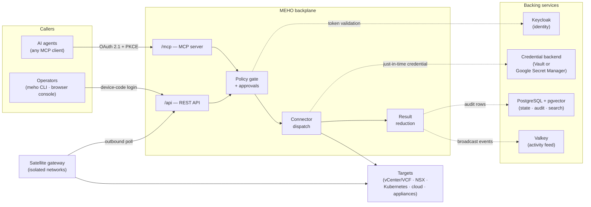

# Reference architecture

MEHO deploys as **one Kubernetes application** (a Helm release)
surrounded by services you already run. This page names every box in
the picture, what it does, and — the part that matters when you plan an
install — which boxes MEHO ships and which ones you bring.

## Who runs what

| Component | Who provides it | Notes |
|---|---|---|
| Backplane (container image) | **MEHO** — `ghcr.io/evoila/meho` | One Deployment, rendered by the Helm chart. |
| Valkey (activity feed) | **MEHO** — bundled subchart | Installed by the same Helm release; no separate setup. |
| PostgreSQL + pgvector | **You** | Any reachable PostgreSQL with the `vector` extension available. Not bundled — see [the install trail](install/index.md#step-1-pre-create-the-pgvector-extension) for the one privilege nuance. |
| Keycloak | **You** | An existing realm; MEHO needs a handful of clients configured in it — see [Keycloak realm setup](install/keycloak-realm.md). |
| Credential backend | **You** | HashiCorp Vault **or** Google Secret Manager — see [Credential backends](install/credential-backends.md). |
| AI agent / MCP client | **You** | MEHO governs agents; it does not run a model. Bring Claude, Cursor, or any MCP client. |

## The backplane

The backplane is a single Python service (FastAPI) that exposes two
front doors and one governed pipeline behind both:

- **`/mcp`** — an MCP server. AI agents authenticate with OAuth 2.1
  authorization-code + PKCE (the flow the MCP specification mandates)
  and see a catalog of tools: search operations, preview them, call
  them, query results, read the audit trail.
- **`/api`** — a REST API. The `meho` CLI drives it after a device-code
  login; anything that can send a Bearer token can use it directly.

Both doors lead to the same pipeline. There is no privileged side
entrance: a CLI call and an agent tool call are authorised, dispatched,
reduced, audited, and broadcast identically.

The pipeline stages:

1. **Authentication** — every request carries a JWT issued by your
   Keycloak. The backplane validates issuer, audience, and the tenant
   claims that scope everything downstream.
2. **Policy gate** — the operation is checked against the caller's role
   and per-target grants. Operations flagged as dangerous can require
   an explicit approval from a human before they run.
3. **Connector dispatch** — the operation executes through a
   *connector*: a typed implementation that knows how to talk to a
   class of infrastructure (vCenter, NSX, Kubernetes, cloud APIs,
   network appliances). Connectors encode operational sequences — for
   example, evacuating a hypervisor host as one governed operation —
   not just raw API passthrough.
4. **Just-in-time credentials** — if the target needs a credential, the
   backplane fetches it from the credential backend at dispatch time,
   scoped to the caller's tenant. The caller never sees it.
5. **Result reduction** — large results are reduced server-side; the
   caller can drill into the full result set with follow-up queries
   instead of receiving megabytes of raw output.
6. **Audit + broadcast** — the operation lands as an immutable audit
   row in PostgreSQL and as an event on the Valkey-backed activity
   feed.

## Identity: Keycloak

Every caller — human or agent — is a Keycloak identity. MEHO does not
maintain its own user database; it validates the OIDC tokens your realm
issues and reads tenant membership and role from claims on the token.

Three token flows matter:

- **CLI** — `meho login` runs the OAuth device-code flow against a
  public client in your realm.
- **MCP clients** — browser-capable agents run authorization-code +
  PKCE against a second public client.
- **Browser console** — the optional `/ui` console authenticates
  server-side against a confidential client.

[Keycloak realm setup](install/keycloak-realm.md) walks through
creating all of these.

## State: PostgreSQL + pgvector

PostgreSQL is MEHO's only database. It holds the registered targets,
the operations catalog, the append-only audit log, approvals, sensor
state, and the knowledge/memory store. The
[pgvector](https://github.com/pgvector/pgvector) extension provides the
vector similarity search behind semantic operation discovery and
knowledge retrieval — it is the reason the install trail has a
[one-time extension step](install/index.md#step-1-pre-create-the-pgvector-extension).

The database is deliberately **not** bundled in the Helm chart: audit
data has retention and backup requirements that belong with your
platform's PostgreSQL practice, not inside an application chart.

## Activity feed: Valkey

Every governed action emits a broadcast event to
[Valkey](https://valkey.io/) (the open-source Redis fork), giving
agents and operators a shared, real-time view of who is doing what.
Valkey **is** bundled — the chart installs it as a subchart, and no
operator action is needed beyond installing the release.

## Credential backends: Vault or Google Secret Manager

Target credentials (the vCenter password, the Kubernetes token, the
appliance API key) live in a secret store MEHO reads *per operation*,
scoped to the calling tenant — never cached in the agent, never
embedded in MEHO's own configuration. Two backends are supported:
HashiCorp **Vault** (the default) and **Google Secret Manager**. The
choice shapes the install, so it has its own
[decision page](install/credential-backends.md) with an honest support
matrix per backend.

## Targets and connectors

A **target** is a registered piece of your infrastructure: a vCenter,
an NSX manager, a Kubernetes cluster, a cloud project, a firewall. Each
target carries its address, how to authenticate to it (a reference into
the credential backend — never the secret itself), and TLS trust
settings.

A **connector** is the code that operates a class of targets. Each
connector publishes a catalog of operations with descriptions, safety
levels, and approval requirements — that catalog is what agents search
and call. The connector surface today is deepest for the VMware/VCF
estate (vCenter, NSX, SDDC Manager, VCF Operations/Fleet/Logs/
Automation), alongside Kubernetes, cloud, and network-appliance
connectors.

## Operators: CLI and browser console

The **`meho` CLI** is a static Go binary (Linux/macOS, amd64/arm64),
released with signed checksums on every release. It logs in with the
device-code flow — which works from private networks and
jump hosts, because only the operator's browser needs to reach
Keycloak's login page. Registering targets and secrets is CLI (or REST)
work by design: those write paths are deliberately not exposed as MCP
tools.

The **browser console** (`/ui`) is an optional, read-heavy operator
surface: dashboards for sensors, approvals, audit, and the activity
feed. It is off by default and enabled all-or-nothing via chart values.

## Satellite gateway

Some targets live in networks the central backplane cannot dial:
behind NAT, in a private control plane, on an isolated management
network. The **satellite gateway** is a second deploy mode of the same
backplane image that runs *inside* such a network and dials **out** to
the central instance — never the reverse. It polls for authorised work,
executes read-only operations locally against the same connector
surface, and reports results back. Authorisation, approval, and audit
all stay central: a satellite cannot self-authorise anything.

The satellite gateway is a **Beta** feature — see its entry in the
[feature maturity index](reference/maturity.md).

## What MEHO is not

- **Not an agent runtime.** MEHO does not run a model and does not
  schedule prompts. It governs what any MCP client is allowed to do.
- **Not a session broker.** Tools like Teleport or StrongDM broker
  *human* sessions (SSH, database, kubectl). MEHO authorises and audits
  *individual agent actions*, per call, with infrastructure-aware
  connectors.
- **Not a SaaS.** You run everything; your audit trail stays in your
  PostgreSQL.

## Next step

Follow [the install trail](install/index.md).
