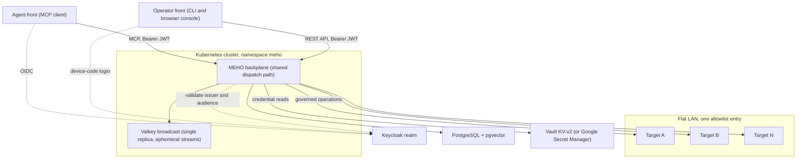
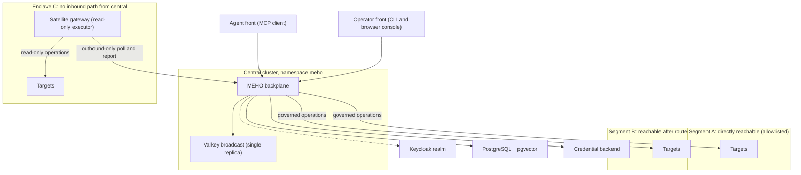
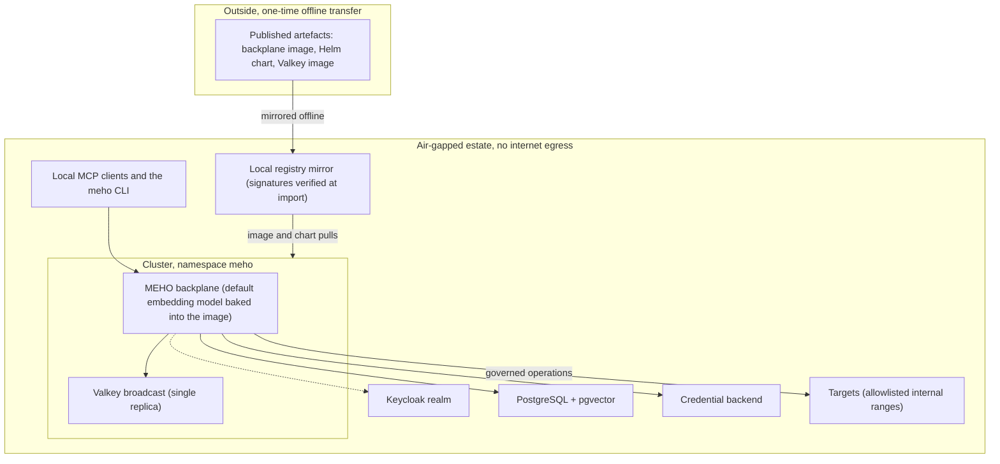
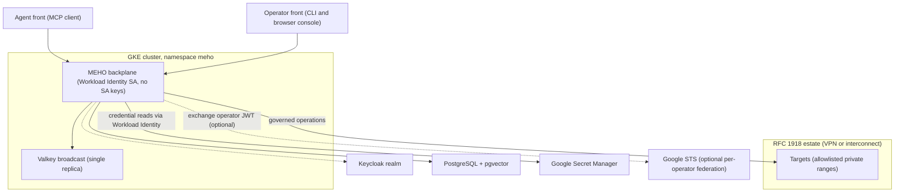
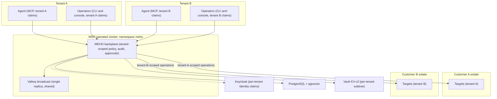

# Deployment shapes

MEHO ships as **one Helm chart**. The five shapes below are not five
products and not five installs — they are the five ways real estates
differ: network topology, credential backend, and tenancy. Every shape
runs the same chart with the same components; what changes is which
network the backplane can dial, where credentials live, and how many
customers share one release.

Pick a shape before you start the install. It decides three things you
cannot easily change later: which address ranges you allowlist, whether
you need a credential store you don't already run, and whether any part
of your estate needs a gateway rather than a route.

## Which shape is yours?

| If your estate looks like this | Your shape |
|---|---|
| One network segment; the cluster can dial every target directly | [Flat LAN](#flat-lan) |
| Several management segments, and at least one enclave the cluster can never dial | [Segmented network with satellite gateways](#segmented-network-with-satellite-gateways) |
| No internet egress at all; every artefact arrives by one-time transfer | [Air-gapped](#air-gapped) |
| GKE or GCP-adjacent, and you would rather not run Vault | [Cloud-native without Vault](#cloud-native-without-vault-google-secret-manager) |
| One MEHO release governing several *customers'* estates | [Multi-tenant MSP](#multi-tenant-msp-target-shape) |

Air-gapped is the one shape that **composes** with the others: it adds
an artefact-mirroring workstream on top of a flat-LAN, segmented, or
cloud-native install rather than replacing it.

## What every shape shares

### The components

| Component | Who provides it | Notes |
|---|---|---|
| MEHO backplane | MEHO — `ghcr.io/evoila/meho` | One Deployment from the chart at `oci://ghcr.io/evoila/meho-chart`. Agents reach it over MCP; operators reach it over the REST API with the `meho` CLI and the optional browser console. Both fronts share one governed dispatch path — policy, approvals, audit, result handling. |
| Keycloak realm | You | The OIDC issuer. The backplane needs a confidential client plus the public `meho-cli` device-code client with audience mappers. |
| PostgreSQL + pgvector | You | Operator-managed; the `vector` extension is pre-created once by a superuser, and the chart expects an `asyncpg` DSN. |
| Valkey broadcast | MEHO — in-tree subchart | Installed by the same release. See the availability posture below. |
| Credential backend | You | HashiCorp Vault KV-v2 (the default) **or** Google Secret Manager, selected with `config.credentialBackend`. |
| Targets | You | The governed systems. Each is registered with an address, a *reference* into the credential backend — never the secret itself — and its TLS trust settings. |

Prerequisites, the worked install commands, and the per-row verification
checks for all of the above live in
[`docs/deploying.md`](https://github.com/evoila/meho/blob/main/docs/deploying.md#deploy-from-cold--prerequisites-checklist);
sanitized values files for the on-premises and Google-Secret-Manager
archetypes live in
[`deploy/values-examples/`](https://github.com/evoila/meho/tree/main/deploy/values-examples).

### The private-address guard applies to every shape

The backplane **default-denies** targets whose hostname resolves to a
non-public address — loopback, RFC 1918, link-local, cloud metadata.
Since MEHO exists to govern private infrastructure, essentially every
production install has to name its own ranges in
`config.targetSsrfAllowlist`, for example `"10.0.0.0/8,192.168.0.0/16"`.

This is a scoped opt-in, never a global off-switch: an empty value keeps
the guard fully on, and the intended posture is to list the ranges you
actually manage. Plan the list before the first target registration —
registering a target outside the allowlist is rejected, not warned
about.
([`docs/deploying.md` § Operational chart knobs](https://github.com/evoila/meho/blob/main/docs/deploying.md#operational-chart-knobs).)

### Broadcast runs single-replica, with ephemeral streams

The activity-broadcast bus is deliberately **one replica** in the
current chart: no Sentinel sidecar ships with it, streams are ephemeral
by design, and the chart's values schema *rejects* any replica count
above 1 rather than letting you configure a topology that would not
actually be highly available. A restart therefore loses unconsumed
stream history, and highly-available broadcast is explicitly deferred.
([`deploy/charts/meho/values.yaml`](https://github.com/evoila/meho/blob/main/deploy/charts/meho/values.yaml)
`broadcast:` block and the matching
[`values.schema.json`](https://github.com/evoila/meho/blob/main/deploy/charts/meho/values.schema.json)
constraint.)

This is the same posture in all five shapes, so it is stated once here
rather than repeated below. Broadcast is a **Beta** feature — see the
[feature maturity index](reference/maturity.md).

### The chart fails at render time, not at runtime

Configuration is validated by the chart's JSON schema, so a
mis-configured install fails during `helm template` / `helm install`
before anything runs. The clearest example: if none of `ingress.host`,
`config.backplaneUrl`, or `config.mcpResourceUri` resolves, the chart
refuses to render rather than deploying a silently unusable MCP
endpoint. That is worth knowing before you start: a mistake in any
shape below surfaces at install time with a remediation message, not as
a healthy-looking pod that quietly does nothing.
([`docs/deploying.md` § Deploy from cold](https://github.com/evoila/meho/blob/main/docs/deploying.md#deploy-from-cold--prerequisites-checklist),
MCP-audience row.)

---

## Flat LAN

The smallest production shape: one network segment, every target
directly reachable from the cluster, one entry in the address
allowlist.

**Pick this shape when:**

- Your targets sit in one network segment that the cluster can already
  reach.
- You already run a Keycloak realm and either a Vault or Google Secret
  Manager.
- One team, one tenant, a handful of targets, interactive operators
  only.

**What it still costs you.** "Flat" is a network statement, not an
install shortcut. Every cold-install prerequisite applies unchanged: the
pgvector extension step, the `asyncpg` DSN, the Keycloak clients and
mappers, an internal-CA trust bundle where your services use private
certificates, and a pinned immutable image tag. A flat LAN is still
private address space, so the allowlist entry above is mandatory —
there is no shape in which it is optional.

## Segmented network with satellite gateways

The standard enterprise on-premises shape: several management segments,
the backplane given network identity into each segment it can reach, and
a **satellite gateway** inside each enclave it cannot.

**Pick this shape when:**

- Two or more network segments sit between the cluster and the targets.
- You can give the backplane routes, DNS resolution, and CA trust into
  the management networks it *should* reach.
- At least one zone — a NAT-ed site, a private control plane, a
  no-inbound network — will never accept a connection from the central
  cluster.

**Satellite gateways are read-only by design — and that is a planning
constraint, not a limitation to work around.** A gateway is a dumb
executor of centrally authorised work. It runs the same container image
in a different mode, holds no local database, broadcast bus, console, or
MCP endpoint, and **dials outbound only** — it polls the central
instance for its assignment, executes read-only operations locally
against the same connector surface, and reports results back. All
authorisation, approval, and audit stay central; a gateway never
self-authorises.

The consequence is worth stating plainly to whoever is planning the
rollout: **an enclave served only by a satellite gateway gets
observation, not change automation.** Write workflows require the
central backplane to reach the target itself. Design the segment map
around that before anyone promises otherwise. Implementation detail:
[`docs/codebase/satellite-runner.md`](https://github.com/evoila/meho/blob/main/docs/codebase/satellite-runner.md).
The satellite gateway is a **Beta** feature — see the
[feature maturity index](reference/maturity.md).

**Every reachable segment is its own small project.** Routes, DNS, CA
trust, and one more entry in `config.targetSsrfAllowlist` per segment.
Zones reachable only through a jump host or a remote-desktop gateway are
outside all of this — classify them as observe-only and scope them out
explicitly rather than discovering it mid-install.

**Budget for the tail, not the registration.** In one field
deployment, twenty-two targets were registered in two days; the access,
trust, and routing work behind them ran for weeks afterwards. Target
registration is the fast part of this shape. Per-segment network
identity is the slow part, and it is where the calendar actually goes.

## Air-gapped

The no-egress shape: every artefact is mirrored into the estate once,
signature-verified on the way in, and the platform then runs with no
internet path at all.

**Pick this shape when** your estate has no internet egress — or when
registry pulls must go through a mirror you control. It adds a mirroring
workstream to whichever of the other shapes describes your network; it
does not change the architecture.

**A default install needs no internet egress.** The default embedding
model (`BAAI/bge-small-en-v1.5`) is baked into the container image:
offline, version-locked, no model download and no cache volume. The
caveat is one-directional — setting a **custom**
`config.retrievalEmbeddingModel` makes the backplane download it at
runtime, which is exactly what an air-gapped estate cannot do. Keep the
default model.

**Three artefacts have to be mirrored:**

1. the backplane image, `ghcr.io/evoila/meho`;
2. the Helm chart, `oci://ghcr.io/evoila/meho-chart`;
3. the broadcast subchart's Valkey image, `valkey/valkey` — it comes
   from Docker Hub, not from the MEHO registry, and it is the one people
   forget.

All three are cosign keyless-signed, so the mirror import step can
verify provenance before anything enters the estate; the verification
commands are in the
[repository README](https://github.com/evoila/meho#verify-image--chart--cli-signatures).

**Cloud-hosted AI clients do not work here, and cannot be made to.**
A hosted MCP client has to reach your backplane over the public
internet. An air-gapped estate has no such path by definition, so this
shape is local MCP clients and the `meho` CLI only. Set that expectation
during planning rather than at handover — it is the single most common
air-gap surprise.

## Cloud-native without Vault (Google Secret Manager)

The GCP-native shape: no Vault anywhere. Target credentials live in
Google Secret Manager and are read under GKE Workload Identity — no
service-account JSON keys — while the governed estate itself stays on
private RFC 1918 ranges behind a VPN or interconnect.

**Pick this shape when** you want out of running Vault, your platform is
GKE or GCP-adjacent, and you would rather not couple "read a credential"
to "be on a particular network" — a managed secret store removes that
coupling, since where the store lives becomes a cloud decision instead
of a network one.

**Setting it up.** `config.credentialBackend: gsm` selects the backend;
`vault.address` stays blank, because the chart schema requires it only
for the Vault backend. The health check's federation proof then reads
through Secret Manager instead of Vault. Worked example:
[`values-gsm-example.yaml`](https://github.com/evoila/meho/blob/main/deploy/values-examples/values-gsm-example.yaml);
narrative in
[`docs/deploying.md` § GSM / Vault-free](https://github.com/evoila/meho/blob/main/docs/deploying.md#gsm--vault-free).

**Three things to plan for:**

- **The private-address guard still applies.** Cloud-hosted backplane,
  private estate — the RFC 1918 ranges behind your VPN or interconnect
  must be allowlisted exactly as they would be on-premises.
- **Per-target IAM is real work.** The reading identity needs
  `roles/secretmanager.secretAccessor` **on each target secret**. That is
  least privilege working as intended, but it is a per-secret grant, not
  a one-time project-level toggle, and it is the step most likely to be
  discovered at first probe rather than during planning.
  ([`docs/codebase/connectors-shared-vault-creds.md` § GCP Secret Manager backend](https://github.com/evoila/meho/blob/main/docs/codebase/connectors-shared-vault-creds.md#gcp-secret-manager-backend-gsm).)
- **Per-operator attribution obligates a background-dispatch
  decision.** Turning on Workload Identity Federation
  (`gsm.workloadIdentityFederation.audience`) makes credential reads run
  as the *calling operator*, so Google's own audit log names the human
  rather than the platform service account. But scheduled work — sensor
  evaluations and other callers with no operator behind them — has no
  token to federate. On a cluster without ambient pod identity you must
  configure the `checkRunner.*` principal, or credentialed sensors read
  nothing, forever and silently. The full decision matrix is in
  [`docs/deploying.md` § Per-operator WIF and background dispatch](https://github.com/evoila/meho/blob/main/docs/deploying.md#per-operator-wif-and-background-dispatch-2642).

The Google Secret Manager backend is a **Beta** feature — see the
[feature maturity index](reference/maturity.md).

## Multi-tenant MSP (target shape)

!!! warning "This is a target shape, not a field-proven one"

    The platform's tenancy primitives are real and shipped —
    per-tenant token claims, tenant-scoped credential namespaces,
    tenant-scoped policy and audit. What has *not* happened yet is a
    production multi-customer estate running on them. Read the diagram
    below as the design the primitives support, and treat a
    multi-customer engagement as pioneering work rather than a
    repeat of something already done. This label is deliberate: MEHO
    publishes a [feature maturity index](reference/maturity.md) so
    adopters can tell shipped-and-proven from shipped-and-untested,
    and this shape belongs on the honest side of that line.

**Pick this shape only when** you genuinely need one MEHO release
governing several *customers'* estates, with per-tenant identity,
credentials, targets, policy, and audit scoping. A single organisation
with several internal teams does not need this — that is one tenant with
several roles.

**Tenant identity rides on token claims.** Every principal carries
tenant claims from your Keycloak realm, and on the Vault backend the KV
tenant-scope guard pins credential references under
`secret/tenants/{tenant_id}/` — default-on since v0.15.0. The per-tenant
layout is a first-class platform contract, not something bolted on for
service providers.
([`docs/deploying.md` § Version-specific upgrade notes](https://github.com/evoila/meho/blob/main/docs/deploying.md#version-specific-upgrade-notes).)

**Network reality multiplies per tenant.** Each customer estate brings
its own segments, allowlist ranges, CA trust, and possibly its own
enclaves — the
[segmented shape](#segmented-network-with-satellite-gateways) applies
*inside every tenant*, and the effort scales with the number of
estates, not the number of MEHO releases.

**Two honest gaps to weigh up front.** There is no shipped worked
example for this shape — no per-tenant values file ships with the chart,
so the first deployment writes it. And the broadcast bus described
[above](#broadcast-runs-single-replica-with-ephemeral-streams) is shared
across all tenants: a restart loses unconsumed stream history for every
tenant at once, and there is no per-tenant broadcast isolation today.
For a service provider that is a real posture conversation, not a
footnote.

## Next step

Once you have picked a shape, follow the
[install trail](install/index.md) — the prerequisites and the
credential-backend decision there are the same in every shape; the
allowlist, the segment map, and the mirroring workstream are the parts
your shape decides.

## Sources

Every operational claim on this page traces to a file in this
repository:

- [`docs/deploying.md`](https://github.com/evoila/meho/blob/main/docs/deploying.md)
  — cold-install prerequisites (pgvector, `asyncpg` DSN, Keycloak
  clients, MCP audience, CA bundle, pinned tag, baked-in default
  embedding model); the Vault and Google Secret Manager install paths;
  per-operator Workload Identity Federation and background dispatch;
  operational chart knobs including `config.targetSsrfAllowlist`;
  version-specific upgrade notes including the Vault tenant-scope
  guard.
- [`deploy/charts/meho/values.yaml`](https://github.com/evoila/meho/blob/main/deploy/charts/meho/values.yaml)
  and
  [`values.schema.json`](https://github.com/evoila/meho/blob/main/deploy/charts/meho/values.schema.json)
  — the `broadcast:` block: single replica, schema-rejected replica
  counts above 1, ephemeral streams, and the Valkey image source.
- [`deploy/values-examples/`](https://github.com/evoila/meho/tree/main/deploy/values-examples)
  — the sanitized on-premises archetype
  (`values-rdc-example.yaml`), the Google Secret Manager archetype
  (`values-gsm-example.yaml`), and the local rehearsal overlay
  (`values-kind.yaml`, explicitly *not* a functional federation
  deploy).
- [`docs/codebase/satellite-runner.md`](https://github.com/evoila/meho/blob/main/docs/codebase/satellite-runner.md)
  — the satellite gateway's outbound-only, read-only, no-local-state
  design.
- [Repository README](https://github.com/evoila/meho#verify-image--chart--cli-signatures)
  — cosign keyless verification for the image, chart, and CLI.
- [Feature maturity index](reference/maturity.md) — the shipped tier of
  broadcast, the satellite gateway, the Google Secret Manager backend,
  and every other non-GA feature named above.
