# Operations substrate (G0.6)

> Read [CLAUDE.md](../../CLAUDE.md) first for the postulates that scope this substrate. This document covers the implementation that landed under [Initiative #388 G0.6](https://github.com/evoila/meho/issues/388).

How MEHO stores every operation an agent can dispatch as a database row, resolves the right connector implementation per target, and routes calls through one dispatcher that applies validation, policy, JSONFlux reduction, audit, and broadcast.

The substrate replaces the v0.2 transitional `_op_map`-per-connector shape documented in [connectors.md](connectors.md). Operations now live as rows in `endpoint_descriptor`; the dispatcher reads them at request time; the agent surface is a small fixed set of meta-tools (per [CLAUDE.md](../../CLAUDE.md) postulate 5) rather than one MCP tool per vendor verb.

## What this substrate does

One sentence: stores every operation an agent can dispatch as a database row, resolves the right connector implementation per target via a tie-break ladder, and routes calls through a single dispatcher that applies authn-bound operator context + JSON-Schema validation + policy gating + JSONFlux reduction + audit + broadcast.

Three connector kinds share the substrate:

- **Generic (ingested)** — operations auto-derived from a vendor OpenAPI spec by G0.7 into `endpoint_descriptor` rows (`source_kind='ingested'`). Examples planned: `vmware-rest-9.0`, `nsx-4.2`, `harbor-2.x`, `hetzner-robot-2026-04`.
- **Typed** — operations hand-coded against a vendor SDK; registered into the same `endpoint_descriptor` table via [`register_typed_operation()`](../../backend/src/meho_backplane/operations/typed_register.py) at connector init (`source_kind='typed'`). Shipped: `vault-1.x`, `k8s-1.x` (kubernetes_asyncio). Planned: `bind9-9.x`, `pfsense-2.7`, `holodeck-9.0`.
- **Composite** — hand-authored handlers that orchestrate other operations via the dispatcher's recursive sub-call (`source_kind='composite'`). Bounded recursion, audit-tree linkage; see [Composites + audit-tree linkage](#composites--audit-tree-linkage).

## The two tables

[Migration `0005_create_endpoint_descriptor`](../../backend/alembic/versions/0005_create_endpoint_descriptor.py) provisions both tables; [migration `0006_add_audit_log_parent_audit_id`](../../backend/alembic/versions/0006_add_audit_log_parent_audit_id.py) adds the audit-tree column the composite branch writes.

### `endpoint_descriptor`

One row per `(product, version, impl_id, op_id)` — covers every operation the dispatcher might route to, regardless of source kind. Source: [`db/models.py::EndpointDescriptor`](../../backend/src/meho_backplane/db/models.py).

| Column                | Type       | Notes                                                                                                                                |
|-----------------------|------------|--------------------------------------------------------------------------------------------------------------------------------------|
| `id`                  | UUID PK    |                                                                                                                                      |
| `tenant_id`           | UUID NULL  | `NULL` → built-in/global op. Non-null → tenant-curated. No FK by soft-FK discipline.                                                  |
| `product`             | Text       | Connector product slug — `"vmware"`, `"vault"`, `"k8s"`.                                                                              |
| `version`             | Text       | Connector version stripe — `"9.0"`, `"1.x"`. Empty string for v1-compat registrations.                                                |
| `impl_id`             | Text       | Implementation discriminator — `"vmware-rest"` vs `"vmware-pyvmomi"`. Empty string for v1-compat.                                     |
| `op_id`               | Text       | Connector-side natural key. Ingested: `"GET:/api/vcenter/cluster"`. Typed: `"vault.kv.read"`. Composite: `"vmware.composite.vm.create"`. |
| `source_kind`         | Text CHECK | `'ingested'` / `'typed'` / `'composite'`. Bounded by a DB CHECK constraint.                                                          |
| `method`, `path`      | Text NULL  | Populated for ingested rows only.                                                                                                    |
| `handler_ref`         | Text NULL  | Dotted Python path. Populated for typed + composite. Resolved at dispatch time via `importlib`.                                      |
| `summary`, `description` | Text NULL | Operator-facing prose. Feeds the embedding text + BM25 index.                                                                        |
| `group_id`            | UUID NULL  | `REFERENCES operation_group(id) ON DELETE SET NULL` — group-less descriptors stay dispatchable.                                       |
| `tags`                | JSON       | Short keyword tags. Part of the embedding text.                                                                                      |
| `parameter_schema`    | JSON       | JSON Schema 2020-12 (OpenAPI 3.1 compatible). Validated by the dispatcher before routing.                                            |
| `response_schema`     | JSON NULL  | Informational in v0.2; consumed by future reducers.                                                                                  |
| `llm_instructions`    | JSON NULL  | Per-op agent guidance (`"when_to_call"`, `"parameter_hints"`, `"output_format"`).                                                    |
| `safety_level`        | Text CHECK | `'safe'` / `'caution'` / `'dangerous'`. v0.2 policy gate consumes this.                                                              |
| `requires_approval`   | Bool       | Forces `status='pending'` audit row + operator decision before dispatch. Orthogonal to `safety_level`.                               |
| `is_enabled`          | Bool       |                                                                                                                                      |
| `embedding`           | vector(384) | pgvector on PG, JSON-encoded Text on SQLite. Populated by the typed-op registrar; same dim as `documents.embedding` (G0.4).         |
| `custom_description`, `custom_notes` | Text NULL | Operator-authored overrides applied by G0.7 review without overwriting the upstream source-of-truth columns.               |
| `created_at`, `updated_at` | timestamptz | `updated_at` advanced on every upsert.                                                                                          |

**Indexes:**

- Two **partial unique indexes** on `(product, version, impl_id, op_id)` — one `WHERE tenant_id IS NULL`, one `WHERE tenant_id IS NOT NULL` including `tenant_id` in the key. SQL's `NULL != NULL` semantics make a single composite UNIQUE useless against duplicate built-in rows; the partial split is enforced by the same migration.
- `endpoint_descriptor_lookup_idx` — b-tree on `(product, version, impl_id, group_id, is_enabled)` — drives the dispatcher's lookup and `list_operation_groups` / `search_operations` paged queries.
- `endpoint_descriptor_bm25_idx` (PG only) — GIN over `to_tsvector('english', coalesce(summary, '') || ' ' || coalesce(description, ''))` — feeds the BM25 half of `search_operations`.
- `endpoint_descriptor_embedding_idx` (PG only) — IVFFlat over `embedding` with `vector_cosine_ops`, `lists=100` — feeds the cosine half. (IVFFlat empty-table caveat: `REINDEX` after the first registrar pass.)

### `operation_group`

Named groupings within one connector implementation — `vmware-rest/9.0` → `vm-lifecycle` / `cluster` / `network`; `vault/1.x` → `kv` / `sys` / `auth`. Source: [`db/models.py::OperationGroup`](../../backend/src/meho_backplane/db/models.py).

Each row carries an LLM-summarised `when_to_use` blurb that `list_operation_groups` returns verbatim so the agent picks the right group before calling `search_operations` against it.

Key columns: `product`, `version`, `impl_id`, `group_key`, `name`, `when_to_use`, `review_status`. Review status is a DB-enforced enum: `'staged'` (freshly ingested, awaiting operator review), `'enabled'` (live for dispatch), `'disabled'` (hidden from retrieval). Typed registrations always land as `'enabled'` because the typed connector author already vouched for the group at code review time.

Same partial-unique-index pattern as `endpoint_descriptor`.

### Index strategy + retrieval algorithm reuse from G0.4

`search_operations` runs the same BM25 + cosine + Reciprocal Rank Fusion (RRF) algorithm [`retrieval/retriever.py`](../../backend/src/meho_backplane/retrieval/retriever.py) ships for the `documents` table. Both implementations are intentionally parallel — same RRF fusion math, same per-signal candidate-pull limit (`SEARCH_LIMIT_MAX = 50`), same `EmbeddingService` singleton — but the table schema is different so the SQL diverges. SQLite test fallback re-runs the candidate `SELECT` without the FTS / vector operators (ordered by `op_id` for determinism).

### Tenant scoping rules

Every read query unions two row sets:

- Built-in / global rows (`tenant_id IS NULL`) — visible to every operator.
- Tenant-curated rows (`tenant_id == operator.tenant_id`) — visible only to that tenant's operators.

The dispatcher's [`lookup_descriptor`](../../backend/src/meho_backplane/operations/_lookup.py), [`list_operation_groups`](../../backend/src/meho_backplane/operations/meta_tools.py), and [`search_operations`](../../backend/src/meho_backplane/operations/meta_tools.py) all apply this filter shape. Cross-tenant reads collapse to "not found" (no existence-oracle).

## The connector registry v2

[`connectors/registry.py`](../../backend/src/meho_backplane/connectors/registry.py) keys connector classes on the three-tuple `(product, version, impl_id)` so multiple implementations per product can coexist (planned: `vmware-pyvmomi-7.0` and `vmware-rest-9.0`).

### Public surface

```python
register_connector_v2(
    product="vmware",
    version="9.0",
    impl_id="vmware-rest",
    cls=VmwareRestConnector,
)

list_connector_impls()   # → sorted [(product, version, impl_id), ...]
all_connectors_v2()      # → {(product, version, impl_id): cls, ...} snapshot
```

Keyword-only — three positional strings would invite ordering bugs. Duplicate keys raise `RuntimeError` at module-import time (deploy failure, never request-time confusion).

### Two registry layers

The pre-G0.6 single-key `dict[product, type[Connector]]` lives on as the **v1 layer** for `get_connector(product)` callers — the Kubernetes resolver tests, the `/api/v1/health` Vault federation probe shape, and a few startup checks. The chassis dispatch route it originally backed (`POST /api/v1/connectors/{product}/{op_id}`) was deprecated and removed by T11 (#412); v2-aware code resolves through the new layer.

The shipped v1 entry point `register_connector(product, cls)` dual-writes to **both** tables — v2 gets `(product, "", "")`. Existing v1 registrations participate in v2 resolution without code change. The `KubernetesConnector` still calls `register_connector("k8s", …)` for backward compatibility with the `get_connector("k8s")` callers above; the `VaultConnector` does **not** (its `(version="1.x", impl_id="vault")` v2 entry would race the v1 entry through the resolver tie-break ladder).

### `resolve_connector(target)` — the tie-break ladder

[`connectors/resolver.py`](../../backend/src/meho_backplane/connectors/resolver.py) walks the v2 table to pick the right class for a given target. Inputs: `target.product` (required), `target.fingerprint.version` (optional), `target.preferred_impl_id` (optional operator override).

The full ladder is documented in [connector-resolution.md](connector-resolution.md) with three worked examples; the short version:

1. **Most-specific-version-match wins.** Bounded ranges (`>=X,<Y`) beat half-bounded (`>=X`) beat `None` (no range advertised).
2. **Operator/tenant preference.** When step 1 leaves ≥ 2 candidates and `target.preferred_impl_id` is set, the matching `impl_id` wins.
3. **Class `priority` attribute.** `Connector.priority: int = 0` — higher wins. Use this when two impls share a range and no operator override exists.

After all three steps, ≥ 2 candidates remaining → `AmbiguousConnectorResolution` (a `LookupError` subclass) with a sorted candidate list. Zero candidates → `NoMatchingConnector` (also a `LookupError`).

## The Connector ABC (G0.6 metadata)

[`connectors/base.py`](../../backend/src/meho_backplane/connectors/base.py) — the ABC every connector implementation inherits — grew four class attributes in T3 (#394):

```python
class Connector(ABC):
    product: str = ""                              # G0.2 — product slug.
    version: str = ""                              # G0.6-T3 — version stripe ("9.0", "1.x").
    impl_id: str = ""                              # G0.6-T3 — implementation discriminator.
    supported_version_range: str | None = None     # G0.6-T3 — PEP 440 spec or None.
    priority: int = 0                              # G0.6-T3 — tie-break tiebreaker.
```

Class-level (not instance-level): the resolver consults them on the class itself before the registry creates any instance. PEP 440 specifier grammar via `packaging.specifiers.SpecifierSet` backs the range comparison.

The role of `execute()` post-G0.6 — the original ABC method `Connector.execute(target, op_id, params) -> OperationResult` shipped in G0.2 — is now a **dispatcher shim** in both refactored connectors. Shipped `VaultConnector.execute()` and `KubernetesConnector.execute()` thin-wrap `dispatch(...)`. The original chassis route at `/api/v1/connectors/{product}/{op_id}` that motivated the shim was deprecated and removed by T11 (#412); `POST /api/v1/operations/call` is the canonical dispatch surface. `execute()` stays as the typed-connector branch of the dispatcher (`source_kind == "typed"`) — composite handlers and code paths that build their own `OperationResult` continue to call `connector.execute(target, op_id, params)` directly.

## Operation registration paths

Three source-kinds, three registration paths, one `endpoint_descriptor` table.

### Typed connectors — `register_typed_op_registrar` + lifespan-driven runner

The canonical pattern, established by the Vault refactor (#390) and matched by Kubernetes (#391):

```python
# connectors/vault/__init__.py

from meho_backplane.connectors.registry import register_connector_v2
from meho_backplane.connectors.vault.connector import VaultConnector
from meho_backplane.connectors.vault.ops import register_vault_typed_operations
from meho_backplane.operations.typed_register import register_typed_op_registrar

register_connector_v2(
    product="vault",
    version="1.x",
    impl_id="vault",
    cls=VaultConnector,
)

# Queue the typed-op upsert onto the lifespan-driven registrar list.
register_typed_op_registrar(register_vault_typed_operations)
```

Two phases:

- **Synchronous (import time)** — `register_connector_v2(...)` lands the registry entry; `register_typed_op_registrar(...)` appends an `async def register_xxx_typed_operations` callable to a module-level list on `meho_backplane.operations.typed_register`.
- **Asynchronous (lifespan startup)** — the FastAPI `lifespan` hook calls [`_eager_import_connectors()`](../../backend/src/meho_backplane/connectors/registry.py) (so every subpackage self-registers) and then [`run_typed_op_registrars()`](../../backend/src/meho_backplane/operations/typed_register.py) (which iterates the registrar list sequentially). Each registrar invokes [`register_typed_operation(...)`](../../backend/src/meho_backplane/operations/typed_register.py) for every op it ships — once per `(product, version, impl_id, op_id)` natural key.

The two-phase shape lets every `__init__.py` stay sync while the typed-op upserts await on the DB and the embedding pipeline.

`register_typed_operation()` is idempotent across restarts: it composes the embedding text from `summary + description + custom_description + tags`, SHA-256s it, and **skips re-embed** when the persisted row's text hash matches. A connector with 50 typed ops avoids 50 ONNX inferences on every pod restart when descriptions are unchanged.

**Forbidden handler shapes:** closures, lambdas, `functools.partial` wrappers, and non-coroutine functions are rejected at registration time with `HandlerRefError` — the dispatcher resolves `handler_ref` at dispatch time via `importlib.import_module` + chained `getattr`, which can only round-trip module-level functions and bound methods.

### Generic (ingested) connectors — G0.7 spec ingestion

G0.7 (#389, separate Initiative) populates `endpoint_descriptor` rows directly from an OpenAPI 3.0/3.1 spec. `source_kind='ingested'`; `method` + `path` populated; `handler_ref` NULL (the dispatcher's ingested branch uses the connector's HTTP transport, not a dotted handler). The G0.7 review queue gates ingested rows behind `review_status='staged'` until an operator approves them; the dispatcher only routes to `'enabled'` ops.

Architecture details for G0.7 land in a separate doc (out of scope for this one).

### Composites — `register_typed_operation` with `source_kind='composite'`

Composite handlers are registered the same way as typed ops but with `source_kind='composite'`. The handler signature differs (it receives a `dispatch_child` callable — see [Composites + audit-tree linkage](#composites--audit-tree-linkage)); the registration shape is otherwise identical.

## The dispatcher

[`operations/dispatcher.py::dispatch`](../../backend/src/meho_backplane/operations/dispatcher.py) is the single entry point every operation flows through — every `call_operation` meta-tool, every CLI alias verb, every composite-handler-internal sub-call.

### Pipeline

```mermaid
flowchart TD
    A[dispatch&#40;operator, connector_id, op_id, target, params&#41;] --> B[1. parse connector_id]
    B --> C[2. lookup_descriptor]
    C -->|miss| Z1[result_unknown_op]
    C -->|hit| D[3. validate_params]
    D -->|invalid| Z2[result_invalid_params]
    D -->|valid| E[4. policy_gate]
    E -->|denied| Z3["result_denied&#10;+ audit_and_broadcast_safe"]
    E -->|allowed| F[5. resolve_connector]
    F -->|no match| Z4[result_no_connector]
    F -->|cls| G["6. branch on source_kind&#10;ingested / typed / composite"]
    G --> H["7. reduce&#10;(JSONFlux)"]
    H -->|reducer raises| Z5["connector_error&#10;+ audit_and_broadcast_safe"]
    H -->|raw, handle| I["8. audit_and_broadcast_safe&#10;(write row, publish event)"]
    I --> J[9. return OperationResult]
    G -->|handler raises| Z6["connector_error&#10;+ audit_and_broadcast_safe"]
    G -->|ImportError / TypeError| Z7["handler_unreachable&#10;+ audit_and_broadcast_safe"]
```



The eight phases (steps 2–9) map directly to function calls in the dispatcher module:

1. **Parse `connector_id`** → `(product, version, impl_id)` via [`_lookup.parse_connector_id`](../../backend/src/meho_backplane/operations/_lookup.py). Convention: `connector_id` is `"<impl_id>-<version>"` (e.g. `"vmware-rest-9.0"`, `"kubernetes-asyncio-1.x"`); the parser splits on the last hyphen-major-version pattern.
2. **Look up `EndpointDescriptor`** by the natural key `(tenant_id, product, version, impl_id, op_id)` with the tenant union (`tenant_id IS NULL OR tenant_id == operator.tenant_id`). Miss → structured `unknown_op` error with `known_op_count` in `extras` so the agent's "did you mean" path has a signal.
3. **Validate `params`** against `descriptor.parameter_schema` via `jsonschema.Draft202012Validator`. Invalid → structured `invalid_params` error carrying every validator path that failed.
4. **Policy gate.** v0.2 default-allow; `requires_approval=True` → `denied`. The gate writes an audit row before returning (so denials are visible in `audit_log` even though the op never executed).
5. **Resolve the connector class** via `resolve_connector(target)` and instantiate it (cached at module level via [`_handler_resolve.get_or_create_connector_instance`](../../backend/src/meho_backplane/operations/_handler_resolve.py)). Resolver miss → structured `no_connector` error.
6. **Branch on `descriptor.source_kind`** — see [`operations/_branches.py`](../../backend/src/meho_backplane/operations/_branches.py).
7. **JSONFlux-wrap the response via the `Reducer`.** v0.2 default is `PassThroughReducer`; the call is **wrapped in `try/except`** so reducer exceptions land as `connector_error` (with the audit row + broadcast event still firing).
8. **Write the audit row + publish a broadcast event** via [`_audit.audit_and_broadcast_safe`](../../backend/src/meho_backplane/operations/_audit.py). Audit failure → logged at error level; broadcast skipped (the event would reference a phantom row). Broadcast failure → logged, fail-open per `publish_event`'s contract.
9. **Return the `OperationResult`.**

### Error contract — "always return, never raise"

The dispatcher never raises; it always returns an `OperationResult`. Every error-shaped exit carries a structured `error` string of the form `"<code>: <human-readable>"` so callers can both string-match (`error.startswith("unknown_op:")`) and parse the suffix for display. Detail payloads land in `extras`. Codes:

| Code                  | When                                                                                  |
|-----------------------|---------------------------------------------------------------------------------------|
| `unknown_op`          | Natural key didn't resolve a descriptor.                                              |
| `invalid_params`      | `params` failed JSON Schema validation.                                               |
| `no_connector`        | Resolver couldn't pick a connector for the target.                                    |
| `handler_unreachable` | `importlib` couldn't resolve `handler_ref`, or the resolved symbol is not callable.   |
| `denied`              | Policy gate denied the call.                                                          |
| `connector_error`     | Connector / handler / reducer raised. Exception class + (length-capped) message in `extras`. |

Why always-return: two distinct surfaces consume `dispatch()`. HTTP routes via FastAPI — a raised exception turns into a 500 via the chassis handler, useful for genuine programming bugs (deleted module) but not for user-input errors. MCP tool handlers + CLI verbs + recursive composite calls — the caller wants a structured result it can render; a raised exception across the MCP JSON-RPC boundary turns into a generic 500 with no diagnostic surface. Returning a structured `OperationResult` for every operator-visible failure mode keeps the contract uniform across the three call sites.

### `OperationResult` shape

[`connectors/schemas.py::OperationResult`](../../backend/src/meho_backplane/connectors/schemas.py) — frozen Pydantic model with `MappingProxyType`-wrapped `extras`:

```python
class OperationResult(BaseModel):
    model_config = ConfigDict(frozen=True)
    status: str                              # "ok" | "error" | "denied"
    op_id: str
    result: dict[str, Any] | list[Any] | None = None
    error: str | None = None
    duration_ms: float
    handle: ResultHandle | None = None       # Always None in v0.2 (PassThroughReducer)
    extras: Mapping[str, Any] = ...          # frozen via @model_validator(mode="after")
```

Treat `result + handle` as a tagged union: `result` carries either the raw payload (no reduction) or the reduced summary (reduction happened); `handle is not None` signals the **full** payload is addressable via the reducer's backing store. v0.2's `PassThroughReducer` always leaves `handle=None`.

### Path-parameter substitution for ingested ops

[`_branches.py::_substitute_path`](../../backend/src/meho_backplane/operations/_branches.py) handles OpenAPI path-templating. `parameter_schema` properties carry an `x-meho-param-loc` extension (set by G0.7's ingester) — one of `"path"` / `"query"` / `"header"` / `"body"` (default `"query"`). The dispatcher splits incoming `params` into four buckets, substitutes `{var}` placeholders in `descriptor.path` with `urllib.parse.quote(safe="")`-encoded values, and routes idempotent verbs (GET / HEAD / OPTIONS) through `HttpConnector._request_json` (with retry) and non-idempotent verbs through `HttpConnector._post_json` (no retry).

### Audit contextvar binding pattern

Two contextvars participate in audit-row composition:

- `parent_audit_id_var` (in [`_audit.py`](../../backend/src/meho_backplane/operations/_audit.py)) — set by the composite branch (see below) so the child dispatch's audit row links back to its parent via the `audit_log.parent_audit_id` column (migration `0006`).
- `audit_target_id` (a structlog `contextvars` key, bound by [`meta_tools.py::call_operation`](../../backend/src/meho_backplane/operations/meta_tools.py)) — surfaces the resolved target's UUID to the chassis `AuditMiddleware` for non-dispatcher write paths. The dispatcher's own audit row uses `descriptor.target_id` directly, not via this contextvar (`audit_log.target_id` is a real column added by [#351 G0.3-T1](https://github.com/evoila/meho/issues/351)).

## Composites + audit-tree linkage

[`operations/composite.py`](../../backend/src/meho_backplane/operations/composite.py) ships the runtime contract composite handlers receive when the dispatcher's `composite` branch fires.

### `DispatchChild` Protocol

```python
class DispatchChild(Protocol):
    async def __call__(
        self,
        *,
        connector_id: str,
        op_id: str,
        params: dict[str, Any],
        target: Any = ...,
    ) -> OperationResult: ...
```

Composite handlers receive `dispatch_child: DispatchChild` (NOT raw `dispatch`). Building the callable closes over the parent's `operator` / `target` / `audit_id` so the handler reads as plain business logic:

```python
async def vmware_vm_create_composite(
    operator: Operator,
    target: Any,
    params: dict[str, Any],
    dispatch_child: DispatchChild,
) -> dict[str, Any]:
    folder = await dispatch_child(
        connector_id="vmware-rest-9.0",
        op_id="GET:/api/vcenter/folder",
        params={"filter.names": [params["folder_name"]]},
    )
    ...
```

Spelling the contract as a `typing.Protocol` rather than a raw `Callable` alias gives mypy + Pyright the keyword-argument shape (`connector_id` / `op_id` / `params` / `target`) so handler call sites are structurally type-checked. The Protocol → factory split also keeps the import graph one-directional (composite handlers depend on the contract; the dispatcher depends on the handlers).

### `parent_audit_id` semantics

The composite branch builds the `dispatch_child` callable via [`get_dispatch_child(...)`](../../backend/src/meho_backplane/operations/composite.py), passing the parent's `audit_id`. The factory closes over `parent_audit_id` and binds it on `parent_audit_id_var` for the duration of each child dispatch. The child's audit row reads the contextvar via `parent_audit_id_var.get()` and writes the UUID to its `audit_log.parent_audit_id` column.

`parent_audit_id` is a real column on `audit_log` (added by [migration `0006`](../../backend/alembic/versions/0006_add_audit_log_parent_audit_id.py) with a `b-tree` index for tree traversal queries) — not a contextvar-only linkage. The G8.2 audit-replay surface walks the parent_audit_id chain to reconstruct a composite's full sub-op history.

### Bounded recursion + cycle detection

A misbehaving handler that calls `dispatch_child(...)` recursively cannot exhaust the call stack. `composite_depth_var` (a `ContextVar[int]` initialised at `0` for top-level dispatches) is pre-incremented inside the `dispatch_child` callable; the next depth is compared against `Settings.composite_max_depth` (default `8`, configurable via the `COMPOSITE_MAX_DEPTH` env var per [`settings.py`](../../backend/src/meho_backplane/settings.py)). An over-depth call raises `CompositeRecursionLimitExceeded` **before** the recursive dispatch fires — no audit row is written for the rejected sub-op; the parent composite's generic exception branch surfaces it as `connector_error`.

The exception carries an `op_id_chain` tuple of every nesting level so operators see exactly which dispatch blew the cap when the parent re-raises.

Per the asyncio contextvar contract, the value is per-task: two concurrent dispatches see independent counters. `asyncio.gather`-fanned-out composites are v0.2.next; v0.2 sequential semantics carry the counter cleanly because each `await` boundary preserves contextvar values.

## JSONFlux integration

[`operations/reducer.py`](../../backend/src/meho_backplane/operations/reducer.py) ships the `Reducer` Protocol + v0.2 `PassThroughReducer` default.

### `Reducer` Protocol contract

```python
@runtime_checkable
class Reducer(Protocol):
    async def reduce(
        self,
        payload: Any,
        schema: dict[str, Any] | None,
        context: dict[str, Any] | None = None,
    ) -> tuple[Any, ResultHandle | None]: ...
```

The dispatcher always invokes `reduce()` after the handler returns and before the audit phase fires. Real reducers (post-G0.6) return a reduced payload + a `ResultHandle` for large set-shaped responses while leaving small/scalar payloads alone. v0.2 ships only `PassThroughReducer` — the no-op default that returns the raw payload verbatim with a `None` handle.

The dispatcher's reducer call is wrapped in `try/except`: a reducer exception lands as `connector_error` with the audit + broadcast still firing. The PassThroughReducer can't raise, but [`set_default_reducer(...)`](../../backend/src/meho_backplane/operations/dispatcher.py) invites swappable real reducers (MinIO/S3 spill, schema validation) that will.

### v0.2 `PassThroughReducer` default

```python
class PassThroughReducer:
    async def reduce(self, payload, schema=None, context=None):
        return payload, None
```

Stateless and pure — the dispatcher instantiates one module-level instance and reuses it across every dispatch call; concurrent dispatches share it safely.

### `ResultHandle` shape (future-facing)

```python
class ResultHandle(BaseModel):
    model_config = ConfigDict(frozen=True)
    handle_id: UUID
    summary_md: str
    schema_: Mapping[str, Any]                                # frozen
    total_rows: int | None = None
    sample_rows: tuple[Mapping[str, Any], ...] | None = None  # frozen
    ttl_seconds: int
```

Frozen Pydantic model with `MappingProxyType`-wrapped nested mappings (via `@model_validator(mode="after")` calling `object.__setattr__` to bypass `frozen=True`'s field guard). Pydantic v2's `frozen=True` is "faux immutability" — it blocks field reassignment but not nested-dict mutation; the wrapping closes that hole so callers can't tamper with a handle post-construction. Matches the sibling `FingerprintResult.extras` / `OperationResult.extras` pattern.

`schema_` carries a trailing underscore to avoid collision with Pydantic's deprecated `BaseModel.schema()` API; it serialises as `schema_` on the wire.

The real `result_query` / `result_aggregate` / `result_export` / `result_describe` meta-tools that read handles back from the backing store land alongside the real reducer in a follow-on Initiative.

## The three operation meta-tools

[`operations/meta_tools.py`](../../backend/src/meho_backplane/operations/meta_tools.py) ships the agent-facing surface over the substrate. Three of the ~17 fixed meta-tools defined in [CLAUDE.md](../../CLAUDE.md) live here:

### `list_operation_groups(connector_id)`

Returns enabled operation groups for a connector. Tenant scoping: union of built-in + tenant-curated rows. Only `review_status='enabled'` groups surface; staged/disabled rows remain hidden from the agent. Operation counts per group are aggregated in a single DB pass (no N+1).

The agent uses this **first** when it doesn't know which group to search within.

### `search_operations(connector_id, query, group=None, limit=10)`

Hybrid BM25 + cosine + RRF retrieval over `endpoint_descriptor` rows scoped to a connector and (optionally) a group. Same RRF algorithm `meho_backplane.retrieval.retriever` ships for the `documents` table. Per-signal scores + ranks are surfaced so the agent (and operators debugging) can see whether a hit came from lexical match, semantic match, or both.

`limit` is clamped to `SEARCH_LIMIT_MAX = 50` — matches the per-signal candidate-pull; more than that returns a strict subset of the same fused list with no extra signal.

### `call_operation(connector_id, op_id, target=None, params={})`

Invokes `dispatch(...)` after resolving the optional `target` descriptor (a partial like `{"name": "rdc-vcenter"}`) into a full `Target` ORM row via `meho_backplane.targets.resolver.resolve_target`. Passing `target=None` is valid for typed operations whose handler doesn't consume a target.

Returns the full `OperationResult` serialised via `model_dump(mode="json")`. Errors surface inside the envelope (`status='error'` + `error='<code>: …'`), not as exceptions.

### Agent-facing surface aligned with CLAUDE.md

Per [CLAUDE.md](../../CLAUDE.md) postulate 5, the agent never sees per-op MCP tools (`vsphere.vm.list`); it sees a fixed set of meta-tools and picks operations through them. Vendor operations reach the agent through `search_operations` + `call_operation`. The three meta-tools register as MCP tools in [`mcp/tools/operations.py`](../../backend/src/meho_backplane/mcp/tools/operations.py).

### REST route mirror

[`api/v1/operations.py`](../../backend/src/meho_backplane/api/v1/operations.py) mirrors the three meta-tools as REST endpoints under `/api/v1/operations/*`:

- `GET /api/v1/operations/groups?connector_id=...` — `list_operation_groups`
- `GET /api/v1/operations/search?connector_id=...&query=...&group=...&limit=...` — `search_operations`
- `POST /api/v1/operations/call` (body: `CallOperationBody`) — `call_operation`
- `GET /api/v1/operations/{descriptor_id}` — inspect a single descriptor (gated on `tenant_admin` because `llm_instructions` is the per-op agent prompt and reading it amounts to a prompt leak)

The CLI `meho operation ...` verbs mirror the same surface. Wire identity across MCP + REST + CLI is the contract every CLI verb relies on.

## Worked example: end-to-end dispatch

A `call_operation(connector_id="vmware-rest-9.0", op_id="GET:/api/vcenter/cluster", target={"name": "rdc-vcenter"}, params={"filter.names": ["prod-cluster"]})` call from MCP wire arrival to `OperationResult` return:

1. **MCP wire arrival.** Claude.ai's MCP client sends a `tools/call` JSON-RPC envelope with `name="call_operation"` and `arguments={...}`. The chassis MCP transport (`/mcp` route) validates `MCP-Protocol-Version`, JWT `aud == MCP_RESOURCE_URI`, and the JSON-RPC envelope shape, then dispatches to the registered `call_operation` handler.

2. **`call_operation` handler.** Resolves the partial `target` descriptor: opens a DB session, calls `resolve_target(session, operator.tenant_id, "rdc-vcenter")`, gets back the `Target` ORM row. Binds `audit_target_id = str(target.id)` on `structlog.contextvars` so the audit row carries it. Invokes `await dispatch(operator=…, connector_id="vmware-rest-9.0", op_id="GET:/api/vcenter/cluster", target=resolved_target, params=…)`.

3. **Dispatcher step 1 — parse.** `parse_connector_id("vmware-rest-9.0")` → `("vmware", "9.0", "vmware-rest")`.

4. **Dispatcher step 2 — descriptor lookup.** `SELECT FROM endpoint_descriptor WHERE (tenant_id IS NULL OR tenant_id = $op_tenant) AND product='vmware' AND version='9.0' AND impl_id='vmware-rest' AND op_id='GET:/api/vcenter/cluster'`. Hit: `source_kind='ingested'`, `method='GET'`, `path='/api/vcenter/cluster'`, `parameter_schema={...}` carrying `filter.names: x-meho-param-loc=query`.

5. **Dispatcher step 3 — validate params.** `Draft202012Validator(parameter_schema).iter_errors(params)` → no errors.

6. **Dispatcher step 4 — policy gate.** `descriptor.safety_level='safe'`, `requires_approval=False` → allowed.

7. **Dispatcher step 5 — resolve connector.** `resolve_connector(target)` walks the v2 registry: `target.product='vmware'`, `target.fingerprint.version='9.0.2'`, `target.preferred_impl_id=None`. The `("vmware", "9.0", "vmware-rest")` entry advertises `supported_version_range=">=9.0,<10.0"`, matches `9.0.2`, wins step 1 (most specific). The class is instantiated (cached at module level via `get_or_create_connector_instance`).

8. **Dispatcher step 6 — branch on `source_kind`.** `dispatch_ingested(...)`: splits params into the four buckets (`filter.names` → query), substitutes `{}` placeholders in `path` (none here), calls `connector._request_json(target, "GET", "/api/vcenter/cluster", raw_jwt=operator.raw_jwt, params={"filter.names": ["prod-cluster"]})`. The vSphere REST returns `[{"cluster": "domain-c1", "name": "prod-cluster", ...}]`.

9. **Dispatcher step 7 — reduce.** `PassThroughReducer.reduce(raw, response_schema, context)` returns `(raw, None)`.

10. **Dispatcher step 8 — audit + broadcast.** `audit_and_broadcast_safe(...)`:
    - INSERT into `audit_log`: `id=audit_uuid`, `operator_sub`, `tenant_id`, `target_id=target.id`, `parent_audit_id=None` (no parent — top-level dispatch), `method='DISPATCH'`, `path='GET:/api/vcenter/cluster'`, `status_code=200`, `duration_ms=42.3`, `payload={"op_id": …, "params_hash": "sha256:…", "source_kind": "ingested", "connector_product": "vmware", "connector_version": "9.0", "connector_impl_id": "vmware-rest", "result_status": "ok"}`.
    - Publish `BroadcastEvent(event_id, ts, tenant_id, principal_sub, principal_name, target_name="rdc-vcenter", op_id="GET:/api/vcenter/cluster", op_class="read", result_status="ok", audit_id=audit_uuid, payload=redact_payload(...))`. Subscribers receive it via the SSE `/api/v1/feed` route.

11. **Dispatcher step 9 — return.** `OperationResult(status="ok", op_id="GET:/api/vcenter/cluster", result=[…], handle=None, duration_ms=42.3, extras=MappingProxyType({}))`.

12. **`call_operation` returns** the `model_dump(mode="json")` shape to the MCP handler, which wraps it in a JSON-RPC `result` envelope and sends it back over the wire.

## Anti-patterns

The substrate replaces several v0.2-transitional shapes documented in [connectors.md](connectors.md). The patterns below are **NOT** acceptable in post-G0.6 code:

- **Hardcoded `_op_map` per connector.** The pre-G0.6 transitional pattern. Operations now live as `endpoint_descriptor` rows. Refactor reference: [#390 VaultConnector](https://github.com/evoila/meho/pull/390), [#391 KubernetesConnector](https://github.com/evoila/meho/pull/391).
- **Per-vendor MCP tools** (`vsphere.vm.list`, `vault.kv.read` registered as their own MCP tools). Violates [CLAUDE.md](../../CLAUDE.md) postulate 5. Vendor operations reach the agent through `call_operation`, not as their own meta-tools.
- **Closure handlers.** `handler_ref` MUST be a dotted path the dispatcher can resolve with `importlib` + `getattr`. Closures, lambdas, and `functools.partial` wrappers are rejected at registration time with `HandlerRefError` (a `ValueError` subclass — existing `except ValueError` in connector init paths catches it).
- **Direct `register_operations()` classmethod calls.** The canonical pattern is `register_typed_op_registrar(callable)` queued at module import + `run_typed_op_registrars()` driven by the lifespan. Vault and K8s converged on this; future connectors follow.
- **`Connector.execute(...)` as the dispatch entry point.** The ABC's `execute()` is now a thin shim over `dispatch(...)` for backward compatibility with the chassis route. New code calls `dispatch(...)` directly (via `call_operation` or a CLI verb).

## Migration from the v0.2 transitional shape

Two refactors shipped under G0.6 to validate the substrate's ergonomics on real typed connectors:

- **#390 — VaultConnector** moved to `register_typed_op_registrar(register_vault_typed_operations)`. Dropped the v1 `register_connector("vault", …)` entry to avoid resolver tie-break ambiguity with the new `(version="1.x", impl_id="vault")` v2 entry. `VaultConnector.execute()` became a dispatcher shim. The health-probe route at `/api/v1/health` falls back to direct `VaultConnector` instantiation when the v1 lookup returns `None`, so probes keep working through the refactor.
- **#391 — KubernetesConnector** mirrored the Vault pattern. Kept the v1 `register_connector("k8s", …)` entry for the chassis route deprecation window (removed when [#412 T11](https://github.com/evoila/meho/issues/412) lands the `/api/v1/operations/call` cutover).

### Pattern for future typed connectors

For a new typed connector under [G3](https://github.com/evoila/meho/issues/214):

1. **Create the package** at `backend/src/meho_backplane/connectors/<product>/`.
2. **Implement the subclass** in `connector.py`: set `product`, `version`, `impl_id`, `supported_version_range`, optionally `priority`; implement `fingerprint`, `probe`, and an `execute` shim that calls `dispatch(...)`.
3. **Author typed-op handlers** as `async def` module-level functions (or bound methods on the connector class).
4. **Write a registrar** in `ops.py` as `async def register_<product>_typed_operations(*, embedding_service=None) -> None:` that calls `register_typed_operation(...)` for every op. Pass the `embedding_service` test-seam through to each call so chassis tests can inject a stub.
5. **Register in `__init__.py`:**
   ```python
   register_connector_v2(product=…, version=…, impl_id=…, cls=...)
   register_typed_op_registrar(register_<product>_typed_operations)
   ```
6. **Restart.** The lifespan eager-imports the subpackage, then runs the registrar.

For a new generic (ingested) connector — file a G0.7 ingestion job; the spec ingester populates `endpoint_descriptor` rows directly. No Python code per op.

For a composite — author the handler as an `async def` with the `dispatch_child: DispatchChild` parameter, then register it via `register_typed_operation(..., source_kind="composite", handler=...)`. Recursion is bounded automatically.

## References

- Parent Initiative: [#388 G0.6 Operation registry + resolver + dispatcher + JSONFlux substrate](https://github.com/evoila/meho/issues/388).
- Prerequisite tasks (all merged on `main`): [#392 T1](https://github.com/evoila/meho/issues/392) tables + ORM; [#393 T2](https://github.com/evoila/meho/issues/393) registry v2 + resolver; [#394 T3](https://github.com/evoila/meho/issues/394) ABC metadata; [#395 T4](https://github.com/evoila/meho/issues/395) `register_typed_operation`; [#396 T5](https://github.com/evoila/meho/issues/396) dispatcher; [#397 T6](https://github.com/evoila/meho/issues/397) Reducer Protocol + ResultHandle; [#398 T7](https://github.com/evoila/meho/issues/398) composite recursion + audit-tree; [#399 T8](https://github.com/evoila/meho/issues/399) meta-tools + REST + MCP.
- Connector refactors: [#390 VaultConnector](https://github.com/evoila/meho/issues/390), [#391 KubernetesConnector](https://github.com/evoila/meho/issues/391).
- Related architecture docs: [connectors.md](connectors.md) (v0.2 transitional baseline this substrate replaces), [connector-resolution.md](connector-resolution.md) (the resolver's tie-break ladder with worked examples), [mcp.md](mcp.md) (the MCP wire path that surfaces `call_operation`).
- ADR: [v0.2-decisions.md](../planning/v0.2-decisions.md) — locked architecture decisions; the substrate operationalises postulates 4–7.
- Spec source: v0.1-spec §"Operations" L289–313 (the canonical contract the substrate operationalises) and §"JSONFlux / result handles" L294–311.
- Best-practices anchor: `.claude/skills/implement-issue/devops_best_practices.md` (architecture docs reflect shipped code; mermaid diagrams for control flow).
