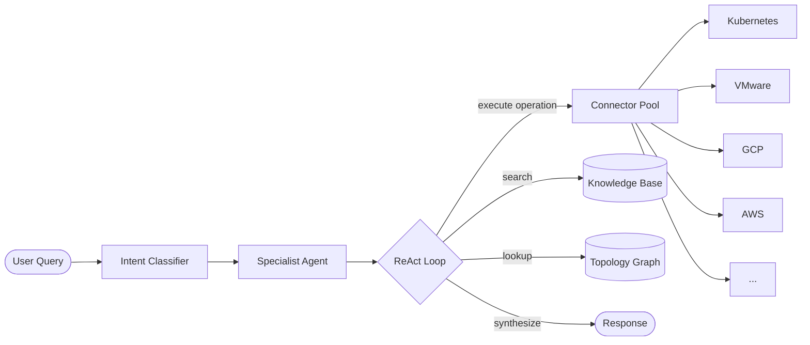
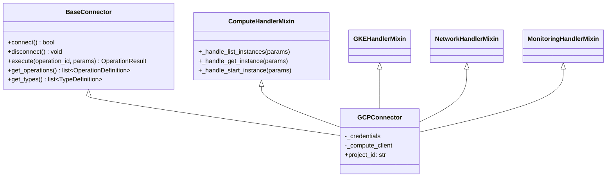
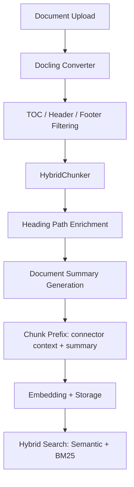

# System Architecture

> Last verified: v2.3 (Phase 101)

MEHO (Machine Enhanced Human Operator) is an AI-powered diagnostic and operations platform for complex IT environments. It connects to external systems -- Kubernetes, VMware, GCP, AWS, Azure, Prometheus, Loki, and more -- via typed connectors, then reasons across all of them using an LLM-powered agent. Operators express intent in natural language; the agent investigates using a ReAct loop that preserves raw data from every system it queries.

**Primary audience:** Contributors wanting to understand how the system works or extend it with new connectors and capabilities.

## High-Level Architecture

A user submits a natural language query. The **routing classifier** determines the query complexity (quick/standard/deep) and dispatches specialists accordingly. The **specialist agent** enters a ReAct (Reason + Act) loop, calling connector operations to gather data from external systems. Results flow back through the agent, which synthesizes a response.



The agent has access to three data sources during investigation: **connector operations** (live queries to external systems), the **knowledge base** (embedded documentation and operational knowledge), and the **topology graph** (discovered entity relationships across systems).

## Module Structure

The backend follows a domain-driven layout under `meho_app/`:

```
meho_app/
  core/                 # Application foundation
    config.py            # Pydantic settings (database, LLM, auth)
    feature_flags.py     # Module feature flags (MEHO_FEATURE_*)
    auth_context.py      # User context from Keycloak JWT
    otel/                # OpenTelemetry instrumentation

  api/                   # FastAPI route handlers
    connectors/          # Connector CRUD + operation execution
    mcp_server/          # MCP server endpoint (external tools connect to MEHO)
    routes_*.py          # Chat, knowledge, topology, events, etc.
    auth.py              # Keycloak JWT validation middleware

  modules/               # Business logic (domain-driven)
    agents/              # LLM agent system
      specialist_agent/  # Primary investigation agent (ReAct loop)
      react_agent/       # Generic ReAct agent base
      orchestrator/        # Query routing and investigation orchestration
        routing.py         # Routing classification (quick/standard/deep)
        config.yaml        # Tiered dispatch budgets
      intent_classifier.py  # Pattern-based request type detection
      skills/            # Markdown skill injection system
    connectors/          # 17+ connector implementations
      base.py            # BaseConnector abstract interface
      pool.py            # Connector registry and factory
      gcp/               # Example: GCP connector
      aws/               # AWS connector
      azure/             # Azure connector
      vmware/            # VMware vSphere connector
      kubernetes/        # Kubernetes connector
      ...
    knowledge/           # Knowledge base
      document_converter.py  # Docling-based document processing
      lightweight_converter.py  # CPU-only pipeline (pymupdf4llm, pdfplumber, RapidOCR)
      ingestion.py       # Ingestion orchestration
      knowledge_store.py # Chunk storage and hybrid search
    topology/            # Entity graph and cross-system correlation
    memory/              # Operator memory extraction
    scheduled_tasks/     # Cron-based task execution
```

Each module under `modules/` is self-contained. Optional modules can be disabled at startup via **feature flags** -- environment variables prefixed with `MEHO_FEATURE_`:

| Flag | Default | Controls |
|------|---------|----------|
| `MEHO_FEATURE_KNOWLEDGE` | `true` | Knowledge base and search |
| `MEHO_FEATURE_TOPOLOGY` | `true` | Topology discovery and graph |
| `MEHO_FEATURE_SCHEDULED_TASKS` | `true` | Cron-based scheduled tasks |
| `MEHO_FEATURE_WEBHOOKS` | `true` | Event ingestion endpoints |
| `MEHO_FEATURE_MEMORY` | `true` | Operator memory system |
| `MEHO_FEATURE_SLACK` | `true` | Slack connector and bot |
| `MEHO_FEATURE_NETWORK_DIAGNOSTICS` | `true` | Network diagnostic tools |
| `MEHO_FEATURE_MCP_CLIENT` | `true` | MCP client connector |
| `MEHO_FEATURE_MCP_SERVER` | `true` | MCP server endpoint |
| `MEHO_FEATURE_EPHEMERAL_INGESTION` | `false` | Ephemeral ingestion workers |
| `MEHO_FEATURE_USE_DOCLING` | `true` | ML-powered document ingestion (false = CPU-only) |

Feature flags are defined in [`meho_app/core/feature_flags.py`](../../meho_app/core/feature_flags.py) using `pydantic-settings`. They are immutable after startup -- a restart is required to change them.

## Connector Pattern

The connector system is the primary extension point for MEHO. All connectors implement the same abstract interface, allowing the agent to interact with any system uniformly.

### BaseConnector Interface

Defined in [`meho_app/modules/connectors/base.py`](../../meho_app/modules/connectors/base.py):

```python
class BaseConnector(ABC):
    def __init__(self, connector_id: str, config: dict, credentials: dict):
        self.connector_id = connector_id
        self.config = config
        self.credentials = credentials

    async def connect(self) -> bool:
        """Establish connection to the external system."""

    async def disconnect(self) -> None:
        """Close connection. Idempotent -- safe to call multiple times."""

    async def test_connection(self) -> bool:
        """Test if connection is alive and working."""

    async def execute(self, operation_id: str, parameters: dict) -> OperationResult:
        """Execute an operation on the external system."""

    def get_operations(self) -> list[OperationDefinition]:
        """Return operation definitions for agent discovery."""

    def get_types(self) -> list[TypeDefinition]:
        """Return entity type definitions for topology discovery."""
```

### Connector Directory Structure

Each connector follows a consistent layout. The connector class inherits from `BaseConnector` and mixes in handler classes, one per service area:



The directory structure for a connector (using GCP as example):

```
meho_app/modules/connectors/gcp/
  __init__.py
  connector.py          # GCPConnector class (BaseConnector + handler mixins)
  handlers/             # One mixin per service area
    __init__.py
    compute_handlers.py   # ComputeHandlerMixin
    gke_handlers.py       # GKEHandlerMixin
    network_handlers.py   # NetworkHandlerMixin
    monitoring_handlers.py
    cloud_build_handlers.py
    artifact_registry_handlers.py
  operations/           # OperationDefinition lists per category
    __init__.py           # Aggregates all: GCP_OPERATIONS = COMPUTE + GKE + ...
    compute.py            # COMPUTE_OPERATIONS = [OperationDefinition(...), ...]
    gke.py
    network.py
    monitoring.py
    cloud_build.py
    artifact_registry.py
  types.py              # TypeDefinition list for topology entities
  serializers.py        # Raw SDK objects -> clean dictionaries
  sync.py               # Topology sync: discover entities, create edges
  helpers.py            # Shared utilities
```

The `execute()` method dispatches to handler methods by convention: `operation_id="list_instances"` calls `_handle_list_instances()`. No routing table is needed -- the method name is derived from the operation ID.

For a step-by-step guide to creating a new connector, see [Adding a New Connector](adding-connector.md).

## Agent Flow

An investigation follows this flow:

1. **User submits a query** via the chat interface (e.g., "Why is the API response time high?").

2. **Intent classifier** (`meho_app/modules/agents/intent_classifier.py`) detects the request type using pattern matching -- no LLM call. Request types include `DATA_QUERY`, `ACTION`, `KNOWLEDGE`, `DATA_RECALL`, and `DATA_REFORMAT`. This guides context injection but does not restrict the agent's tools.

3. **Specialist agent** (`meho_app/modules/agents/specialist_agent/agent.py`) enters a **ReAct loop** (Reason + Act). In each iteration the agent:
    - **Thinks:** Analyzes what it knows and what it needs to find out.
    - **Acts:** Calls a connector operation via `execute()`, searches the knowledge base, or queries the topology graph.
    - **Observes:** Examines the result and decides whether to continue investigating or synthesize a response.

4. **Connector operations** are invoked via the connector pool (`meho_app/modules/connectors/pool.py`), which routes to the correct connector implementation based on `connector_type`. The agent sees all connectors through the same `BaseConnector` interface.

5. **Response synthesis:** When the agent has enough information (or reaches its budget limit), it produces a final response with citations to the data it gathered.

Key design decisions:

- **Budget controls:** The specialist agent has a configurable step budget (default 8, extendable to 12) to prevent runaway investigations. Loop detection stops infinite cycling.
- **Prompt caching:** Investigation state is injected as user messages (not system prompt) to maintain prefix cache stability across turns.
- **Skill injection:** Connector-specific markdown skills are injected into the system prompt, giving the agent domain knowledge without hardcoded logic.
- **Memory injection:** Operator memories (key learnings from past investigations) are included automatically -- operator memories are always present, auto-extracted memories are retrieved via semantic search with a 5K token budget.

## Data Pipeline (Knowledge)

The knowledge system lets operators upload documents (PDF, DOCX, HTML) that become searchable by the agent during investigations.



The pipeline, implemented in [`meho_app/modules/knowledge/document_converter.py`](../../meho_app/modules/knowledge/document_converter.py) and [`meho_app/modules/knowledge/ingestion.py`](../../meho_app/modules/knowledge/ingestion.py):

1. **Docling conversion:** IBM Docling parses the document into a structured representation with element-type labels (headings, paragraphs, tables, TOC entries, page headers/footers).

2. **Filtering:** TOC entries, page headers, and page footers are excluded before chunking to reduce noise.

3. **HybridChunker:** Creates semantic chunks (max 512 tokens) that respect document structure -- chunks don't split mid-paragraph or mid-table. Peer sections are merged when they fit within the token budget.

4. **Heading path enrichment:** Each chunk is contextualized with its heading ancestry (e.g., "Chapter 3 > Networking > Firewall Rules > ...").

5. **Document summary:** A 1-2 sentence summary is generated via LLM (Sonnet 4.6) from the first ~16K characters. This summary is prepended to each chunk as context.

6. **Embedding and storage:** Chunks are embedded and stored. At query time, hybrid search combines semantic similarity with BM25 keyword matching.

Knowledge is scoped at three tiers: **global** (available to all connectors), **connector-type** (e.g., all Kubernetes connectors), and **connector-instance** (specific to one connector).

## Extension Points

MEHO is designed to be extended in four primary ways:

### New Connector

The most common extension. Add a new connector to integrate MEHO with an additional system. See [Adding a New Connector](adding-connector.md) for a step-by-step walkthrough.

**Where:** `meho_app/modules/connectors/your_connector/`

### New Agent Capability (Skills)

Skills are markdown files that inject domain expertise into the agent's system prompt. Adding a skill does not require writing Python code -- just create a markdown file describing how to investigate a specific domain.

**Where:** `meho_app/modules/agents/skills/` and the `orchestrator_skills` database table.

### New Knowledge Source

Add support for new document types in the knowledge pipeline. The Docling converter currently supports PDF, DOCX, and HTML.

**Where:** `meho_app/modules/knowledge/document_converter.py` (extend `_MIME_TO_FORMAT` mapping)

### New Topology Entity Type

Define new entity types for the topology graph by adding `TypeDefinition` entries in a connector's `types.py` and implementing the `sync.py` discovery logic.

**Where:** `meho_app/modules/connectors/your_connector/types.py` and `sync.py`

## Key Concepts

| Concept | Definition | Location |
|---------|-----------|----------|
| **OperationDefinition** | Declares a callable operation with ID, name, description, category, parameters, and trust level. Stored in DB and discovered by the agent via search. | `meho_app/modules/connectors/base.py` |
| **TypeDefinition** | Declares an entity type (e.g., VirtualMachine, Pod) with its properties. Used for topology graph discovery. | `meho_app/modules/connectors/base.py` |
| **OperationResult** | Return type from `execute()`. Contains `success`, `data`, `error`, `error_code`, and `duration_ms`. | `meho_app/modules/connectors/base.py` |
| **Trust Levels** | Operations are classified as **READ** (safe, no approval needed), **WRITE** (modifies state, requires approval), or **DESTRUCTIVE** (irreversible, requires explicit approval). | `meho_app/modules/agents/models.py` |
| **Feature Flags** | Environment variables (`MEHO_FEATURE_*`) that enable/disable optional modules at startup. Immutable after boot. | `meho_app/core/feature_flags.py` |
| **Topology Entities** | Discovered resources (VMs, pods, clusters) stored as nodes in a graph with cross-system edges (SAME_AS, RUNS_ON, CONTAINS). | `meho_app/modules/topology/` |
| **Skills** | Markdown documents injected into the agent's system prompt to provide domain-specific investigation knowledge. | `meho_app/modules/agents/skills/` |
| **ReAct Loop** | The Reason + Act execution pattern. The agent thinks about what to do, executes an action (tool call), observes the result, then decides whether to continue or synthesize. | `meho_app/modules/agents/specialist_agent/agent.py` |
