# Spec ingestion (G0.7)

> Read [CLAUDE.md](../../CLAUDE.md) first for the postulates that scope this pipeline. Sister doc to [operations-substrate.md](operations-substrate.md) (G0.6) — that doc owns the destination tables and dispatcher; this one owns the pipeline that *populates* them from vendor specs. Covers the implementation that landed under [Initiative #389 G0.7](https://github.com/evoila/meho/issues/389).

How MEHO turns a vendor OpenAPI document into rows in `endpoint_descriptor` + `operation_group` that the agent's [`search_operations`](operations-substrate.md#search_operationsconnector_id-query-groupnone-limit10) and [`call_operation`](operations-substrate.md#call_operationconnector_id-op_id-targetnone-params) meta-tools can resolve — without ever exposing a per-op MCP tool ([CLAUDE.md](../../CLAUDE.md) postulate 5).

## What this pipeline does

One sentence: take an OpenAPI 3.0/3.1 spec, parse it into `EndpointDescriptorProto` rows, ask an LLM to propose 8–15 operation groups + per-group `when_to_use` hints, stage the connector for operator review (`review_status='staged'`, every op `is_enabled=False`), and let the operator enable it once they have polished the LLM output and stamped per-op overrides.

The pipeline operationalises [CLAUDE.md](../../CLAUDE.md) postulate 4 (operation grouping + LLM hints, operator-reviewable) and the v0.1-spec's "auto-derive is the primary operation source" mandate ([v0.1-spec §3 L289–313](https://github.com/evoila-bosnia/claude-rdc-hetzner-dc/blob/main/docs/meho-coordination/v0.1-spec.md)).

### Supported spec formats

**v0.2 ships OpenAPI 3.0/3.1 only.** The parser ([`ingest/openapi.py`](../../backend/src/meho_backplane/operations/ingest/openapi.py)) accepts either YAML or JSON, sniffed at decode time. Both `3.0.x` and `3.1.x` are first-class; the parser rejects every other spec version with `UnsupportedSpecError`.

Deferred to v0.2.next:

- **GraphQL SDL / introspection** — no GraphQL surfaces in the v0.2 connector inventory.
- **WSDL** — no SOAP-without-REST-overlay surfaces in v0.2.
- **proto / gRPC** — no gRPC surfaces in v0.2.
- **Google discovery doc** — defer until G3.7 (gcloud); the call there is "extend G0.7 with an adapter" vs "wrap `google-cloud-python` as a typed connector".

## The five-step pipeline

```mermaid
flowchart LR
    A[OpenAPI spec<br>file:// or https://]
    A --> B[T1<br>parse_openapi]
    B -->|EndpointDescriptorProto list| C[T2<br>register_ingested_operations]
    C -->|DB rows + embeddings<br>+ GenericRestConnector shim| D[T3<br>run_llm_grouping]
    D -->|operation_group + group_id| E[T4<br>ReviewService]
    E -->|staged → enabled| F[T8<br>vSphere canary]
    F -->|search_operations<br>top-3 hits OK| G[Live for agents]
```



Each step is an isolated function with its own audit row. The pipeline composes through [`IngestionPipelineService`](../../backend/src/meho_backplane/operations/ingest/pipeline.py) which the CLI (T5), REST (T6), and admin MCP (T7) surfaces all share.

The five-step labels:

- **Parse** — T1 ([`ingest/openapi.py`](../../backend/src/meho_backplane/operations/ingest/openapi.py)) — pure-function YAML/JSON → `EndpointDescriptorProto`. No DB session, no LLM call. Issue [#401](https://github.com/evoila/meho/issues/401).
- **Register** — T2 ([`ingest/register_ingested.py`](../../backend/src/meho_backplane/operations/ingest/register_ingested.py)) — DB upsert + embedding compute + multi-spec merge + auto-registration of a `GenericRestConnector` shim against the v2 connector registry + body-hash skip-re-embed. Issue [#403](https://github.com/evoila/meho/issues/403).
- **Group** — T3 ([`ingest/llm_groups.py`](../../backend/src/meho_backplane/operations/ingest/llm_groups.py)) — two-pass LLM (propose groups, then assign each op to a group). Issue [#404](https://github.com/evoila/meho/issues/404).
- **Review** — T4 ([`ingest/service.py`](../../backend/src/meho_backplane/operations/ingest/service.py)) — `staged → enabled → disabled` state machine + per-op overrides + audit emission per transition. Issue [#402](https://github.com/evoila/meho/issues/402).
- **Verify** — T8 ([`tests/acceptance/test_g07_vsphere_canary.py`](../../backend/tests/acceptance/test_g07_vsphere_canary.py)) — the govc-parity benchmark: ingest the vSphere REST spec, enable, then assert 10 representative queries return the canonical operation in the top-3 hits of `search_operations`. Issue [#408](https://github.com/evoila/meho/issues/408). Operator-facing runbook: [g07-vsphere-canary.md](../cross-repo/g07-vsphere-canary.md).

Operator-facing surfaces — CLI (T5, [#405](https://github.com/evoila/meho/issues/405)), REST (T6, [#406](https://github.com/evoila/meho/issues/406)), admin MCP (T7, [#407](https://github.com/evoila/meho/issues/407)) — all wrap the same `IngestionPipelineService` + `ReviewService` so the wire contract is defined once. See [Operator surfaces](#operator-surfaces) below.

## T1 — the parser

[`parse_openapi(spec_path_or_uri, *, spec_source=None) -> list[EndpointDescriptorProto]`](../../backend/src/meho_backplane/operations/ingest/openapi.py) is the only public entry point. The function is synchronous because callers are CLI / one-shot ingestion endpoints with no event-loop concern, and the surface stays trivially testable.

### Inputs

- `spec_path_or_uri` — a `file://` path or an `http(s)://` URL. Local files read with stdlib; remote files fetched via [`httpx`](https://www.python-httpx.org/) with a 30 s timeout. YAML decoded via PyYAML's `CSafeLoader` (with a pure-Python `SafeLoader` fallback for platforms lacking LibYAML); JSON decoded via stdlib.
- `spec_source` — optional tag string (e.g. `"vcenter.yaml"`) the parser stamps onto every row as a `spec:<source>` entry in `tags`. The downstream T2 merge path keys collision detection off this tag.

### Per-operation output

One `EndpointDescriptorProto` per `(method, path)` entry under `paths`:

| Proto field | Source | Notes |
|---|---|---|
| `op_id` | `f"{METHOD}:{path}"` | Connector-side natural key (e.g. `"GET:/api/vcenter/cluster"`). |
| `method`, `path` | OpenAPI path entry | `method` upper-cased. `path` keeps `{var}` templating verbatim. |
| `summary`, `description` | OpenAPI operation object | Verbatim. Feed the BM25 + cosine retrieval text. |
| `tags` | OpenAPI `tags[]` + `spec:<source>` | Spec tags plus the per-spec marker. |
| `parameter_schema` | Merged path + query + header + body | Flattened JSON Schema 2020-12; properties carry an `x-meho-param-loc` extension (`"path"` / `"query"` / `"header"` / `"body"`) the dispatcher reads to split incoming `params` into four buckets. |
| `response_schema` | Success-response schema | Picks `200 > 201 > 202 > ... > 2XX`. |
| `safety_level` | HTTP-verb heuristic | `safe` for GET/HEAD/OPTIONS; `caution` for POST/PUT/PATCH; `dangerous` for DELETE. Operator overrides at review time. |
| `requires_approval` | Always `False` at parse time | Operator flips for known-destructive ops via `edit-op`. |

### `$ref` resolution — intentionally shallow

[`refs.py::resolve_shallow_ref`](../../backend/src/meho_backplane/operations/ingest/refs.py) inlines exactly one level of `$ref` into each parameter / response / body schema and leaves nested `$ref` strings verbatim. The parameter_schema is self-contained enough for the dispatcher's `jsonschema.Draft202012Validator` to validate the immediate parameter shape; deeper schema dereferencing (chasing nested `$ref`s through `components.schemas`) is the dispatcher's concern.

Two component buckets resolve:

- **`#/components/schemas/<name>`** — JSON Schema components. The dominant shape, used by every vendor spec the canary covers.
- **`#/components/parameters/<name>`** — Parameter Object components (OpenAPI 3.0 §4.7.12 / 3.1 §4.8.7). Used by every operation in vSphere's `vi-json.yaml` via the shared `moId` path parameter. T11 (#501) landed the resolver extension; T1's earlier rejection of this shape is gone.

Three classes of `$ref` are explicitly rejected with `UnsupportedSpecError` so the operator sees the problem at ingest time rather than at dispatch time:

- **Other-bucket component refs.** `$ref: "#/components/requestBodies/..."`, `$ref: "#/components/responses/..."`, `$ref: "#/components/headers/..."`. Not used by any currently-targeted vendor spec (vcenter.yaml, vi-json.yaml, NSX, SDDC Manager); defer until a real spec needs them.
- **Cross-document refs.** `$ref: "other.yaml#/..."`. External files require either a pre-process pass or a v0.2.next resolver extension.
- **`$ref` drill-down.** Refs that walk into a component's sub-tree (`#/components/schemas/X/properties/y`, `#/components/parameters/X/schema`) raise `InvalidSchemaError`.

## T2 — register_ingested_operations

[`register_ingested_operations(session, protos, *, product, version, impl_id, tenant_id, spec_source, embedding_service) -> IngestionResult`](../../backend/src/meho_backplane/operations/ingest/register_ingested.py) is the single write path for ingested rows. Mirrors the typed-connector helper [`register_typed_operation()`](../../backend/src/meho_backplane/operations/typed_register.py) for embedding-text composition and body-hash idempotence.

### Per-call flow

1. **Within-batch collision check.** Set scan over the proto list; any `op_id` appearing twice raises `OpIdCollision` before any DB write.
2. **Auto-register a `GenericRestConnector` subclass.** First ingest of a `(product, version, impl_id)` triple synthesises a class via `type(...)` and registers it through [`register_connector_v2()`](operations-substrate.md#the-connector-registry-v2). The shim's concrete `auth_headers` raises `NotImplementedError` with operator-readable guidance; the review-queue gate keeps every ingested op `is_enabled=False` until the operator replaces the shim with a hand-rolled per-G3.x subclass that adds the auth path.
3. **Per-proto upsert** (delegated to [`_upsert.py`](../../backend/src/meho_backplane/operations/ingest/_upsert.py)):
   - Compose the embedding text from `summary + description + custom_description + tags` and SHA-256 it.
   - Natural-key lookup on `(product, version, impl_id, op_id)` plus a partial-index match on `tenant_id`.
   - **Cross-call collision check.** If a persisted row's `spec:<source>` tag differs from the incoming `spec_source`, raise `OpIdCollision` with both spec sources named (so the operator-facing error names the two colliding specs).
   - **Skip-re-embed path** — persisted row's recomposed embedding-text hash matches → no embedding inference; row's `updated_at` advances, embedding stays.
   - **Re-embed path** — row exists but the embedding text changed → embedding recomputed; row updated.
   - **First-register path** — brand-new row; embedding computed; row inserted.

`IngestionResult` carries per-call counts (`inserted_count`, `updated_count`, `skipped_count`) plus two flags (`connector_registered`, `operations_grouped`). `operations_grouped` is always `False` from T2 alone; T3 flips it when the grouping pass runs.

### Multi-spec merge

A single `IngestionPipelineService.ingest(...)` call processes a list of `SpecSource` entries. Each is parsed and upserted under the **same** connector triple with that spec's URI as the `spec_source` tag. Operators can then distinguish "this op came from `vcenter.yaml`" vs "this op came from `vi-json.yaml`" during review.

The same-`spec_source` re-ingest of an unchanged spec stays on the skip-re-embed path — the cross-call check only fires on a true mismatch. The operationally critical scenario this protects: an unchanged 3,000-op vCenter spec must not re-embed 3,000 operations on every re-ingest.

The vSphere canary at [`tests/acceptance/test_g07_vsphere_canary.py`](../../backend/tests/acceptance/test_g07_vsphere_canary.py) is the operator-visible proof of the merge contract: it drives two sequential `ingest()` calls (vcenter.yaml then vi-json.yaml) under the same `(product, version, impl_id)` triple, asserts per-spec `inserted_count` floors (≥1,200 vcenter, ≥2,000 vi-json), asserts non-overlapping `op_id`s between the two spec sources, and asserts the per-call `connector_registered` flag flips `True → False` across the two calls (auto-shim idempotency). See [#503 G3.1-T3 vi-json.yaml full ingestion](https://github.com/evoila/meho/issues/503) for the acceptance-test extension that locked this contract.

## T3 — LLM-summarised grouping

[`run_llm_grouping(session, *, product, version, impl_id, tenant_id, llm_client, config, embedding_service) -> GroupingResult`](../../backend/src/meho_backplane/operations/ingest/llm_groups.py) opens its own transaction and runs two passes.

### Pass 1 — propose groups

Runs only when no `operation_group` rows yet exist for the connector triple. Sends every unassigned op's `(op_id, summary, tags)` to the LLM with the system prompt at [`ingest/prompts/propose_groups.md.j2`](../../backend/src/meho_backplane/operations/ingest/prompts/propose_groups.md.j2) and asks for an array of `{group_key, name, when_to_use}` proposals.

Output is validated against `GroupProposal` (snake_case key, non-empty fields, bounded `max_length` on prose, no duplicate keys). Validation failure raises `LlmOutputInvalid` carrying `pass_name="propose_groups"`, the verbatim model response (capped in the message preview), and the underlying `ValidationError` / `JSONDecodeError`. The transaction rolls back; the connector stays in whatever state preceded the call.

Persisted rows land `review_status='staged'`.

### Pass 2 — assign each op to a group

Splits the unassigned-op set into batches of `batch_size` (default `50`). Each batch renders the system prompt at [`ingest/prompts/assign_op_to_group.md.j2`](../../backend/src/meho_backplane/operations/ingest/prompts/assign_op_to_group.md.j2) and asks for a JSON object mapping `op_id` to `group_key`, where `group_key` is either one of the Pass-1 keys or the sentinel `"none"`. Each row's `EndpointDescriptor.group_id` is set to the matching group's UUID; sentinel and unknown-key entries leave `group_id=NULL`.

### Call-budget formula

```
llm_call_count = 1 + ceil(op_count / batch_size)
```

One Pass-1 call plus `ceil(N / batch_size)` Pass-2 calls. For vCenter's `vcenter.yaml` (~1,275 ops at `batch_size=50`) that's `1 + 26 = 27` calls per fresh ingest. The audit row T3 writes (`meho.connector.llm_grouping`) records the actual count for cost tracking.

### Two distinct system prompts

Each pass uses its own static system-prompt template so the Anthropic Messages API's cacheable prefix stays stable across batches — the prompt prefix is identical between every Pass-2 batch, only the user-prompt body (rendered from the Jinja template with the batch's ops) changes. This keeps prompt-caching effective on long ingests.

### Idempotency

- **No unassigned ops** → true no-op, zero LLM calls, no audit row.
- **Existing groups present but some ops still unassigned** → Pass 1 skipped, Pass 2 only runs against the unassigned-op subset using the existing groups verbatim. The "partial-regrouping" branch.
- **Fully fresh connector** → both passes run, all groups + assignments persist in one transaction.

### The `LlmClient` Protocol seam

The LLM client is injected as a `Protocol` with one async method, `generate_json(*, system_prompt, user_prompt, response_schema) -> dict`. Production wires the chassis Anthropic-Messages adapter; tests inject a deterministic stub from [`tests/fixtures/llm_groups/`](../../backend/tests/fixtures/llm_groups/). The `IngestionPipelineService` receives the client via a factory parameter so the chassis can lazy-resolve it; the default factory raises `LlmClientUnavailable` and the REST layer maps the exception onto HTTP 503.

## T4 — review queue

[`ReviewService(operator)`](../../backend/src/meho_backplane/operations/ingest/service.py) is the state-machine API every operator surface (T5 CLI, T6 REST, T7 admin MCP) routes write paths through.

### State machine

`OperationGroup.review_status` is a bounded enum enforced via a DB-layer CHECK constraint (migration in [`db/models.py::OperationGroup`](../../backend/src/meho_backplane/db/models.py)). The state transitions:

```text
   ┌──────────┐  enable_connector  ┌──────────┐
   │  staged  │ ───────────────────▶ enabled  │
   └────┬─────┘                    └────┬─────┘
        │                               │ disable_connector
        │                               ▼
        │                          ┌──────────┐
        └─────────────────────────▶│ disabled │
              disable_connector    └──────────┘
                                        │
                                        │ enable_connector
                                        ▼
                                   (back to enabled)
```

- **`staged`** — fresh out of ingest. Every group rendered to the operator for review; every op `is_enabled=False`. Connector does NOT show up in `search_connectors`; operations are NOT dispatchable.
- **`enabled`** — `enable_connector` cascade: every group → `enabled`, every op the operator approved → `is_enabled=True`. Operations become dispatchable; connector surfaces through the agent meta-tools.
- **`disabled`** — `disable_connector` rollback: every group → `disabled`, every op → `is_enabled=False`. Per-op operator overrides (`custom_description`, `safety_level`, `requires_approval`) are **preserved** so a future `enable` resurfaces them verbatim.

### Per-op overrides

Operator edits routed through `ReviewService.edit_op(...)` set columns the parser leaves untouched:

| Column | Operator intent |
|---|---|
| `custom_description` | Replacement agent-facing description that masks the vendor's spec wording. The retrieval text recomposes from this when set. |
| `safety_level` | Override the HTTP-verb heuristic. Bounded enum `safe` / `caution` / `dangerous`. |
| `requires_approval` | Forces `status='pending'` on dispatch + an explicit operator approval before execution. Orthogonal to `safety_level`. |
| `is_enabled` | Re-enable / disable a single op without flipping the whole connector. |

`ReviewService.edit_group(...)` mirrors the same shape for the group's `name` and `when_to_use` hint. Each edit writes a single `meho.connector.edit_op` / `meho.connector.edit_group` audit row in the same transaction as the column update. Operator-edit audit emission means [G8 audit replay](https://github.com/evoila/meho/issues/218) can reconstruct exactly which operator polished which group's `when_to_use` at which time.

### PATCH semantics

`edit_group` and `edit_op` use HTTP PATCH semantics: only fields the operator explicitly named are forwarded to the service. The REST router builds the service-call kwargs via `if "field" in body` key-presence checks so an omitted field never reaches `ReviewService` (an explicit `null` would otherwise be indistinguishable from an omission with `arguments.get(...)`). Same discipline applies to the MCP admin tool handlers.

### Audit emission

Every transition writes exactly one `audit_log` row with an `op_id` from the `meho.connector.*` namespace:

| Action | `op_id` | Op-class |
|---|---|---|
| `ingest()` | `meho.connector.ingest` | write |
| `edit_group()` | `meho.connector.edit_group` | write |
| `edit_op()` | `meho.connector.edit_op` | write |
| `enable_connector()` | `meho.connector.enable` | write |
| `disable_connector()` | `meho.connector.disable` | write |
| `run_llm_grouping()` | `meho.connector.llm_grouping` | write |

Read paths (`list_ingested_connectors`, `get_review_payload`) follow the chassis convention of not emitting an audit row — list queries are too noisy to audit per-call. The G8 audit-replay surface reconstructs the connector's review history by walking the write-side rows.

## Operator surfaces

Three surfaces wrap the same `IngestionPipelineService` + `ReviewService` so the wire contract is defined once. The CLI verb tree (T5), the REST router (T6), and the admin MCP tool set (T7) consume the same shared Pydantic models in [`ingest/api_schemas.py`](../../backend/src/meho_backplane/operations/ingest/api_schemas.py) (`IngestRequest`, `IngestResponse`, `ConnectorListItem`, `EditGroupBody`, `EditOpBody`).

### T5 — CLI verbs (`meho connector ...`)

Cobra verb tree at [`cli/internal/cmd/connector/`](../../cli/internal/cmd/connector/). Thin client over T6's REST routes — no direct service-layer access.

| Verb | Role | Wraps |
|---|---|---|
| `meho connector ingest --product <p> --version <v> --impl <i> --spec <uri> [--spec <uri>...] [--dry-run] [--json]` | `tenant_admin` | `POST /api/v1/connectors/ingest` |
| `meho connector list [--status staged\|enabled\|disabled\|all] [--json]` | `operator` | `GET /api/v1/connectors` |
| `meho connector review <connector_id> [--json]` | `operator` | `GET /api/v1/connectors/{id}/review` |
| `meho connector edit-group <connector_id> <group_key> [--when-to-use <text>\|@file] [--name <text>]` | `tenant_admin` | `PATCH /api/v1/connectors/{id}/groups/{group_key}` |
| `meho connector edit-op <connector_id> <op_id> [--custom-description ...] [--safety ...] [--requires-approval\|--no-requires-approval] [--enable\|--disable]` | `tenant_admin` | `PATCH /api/v1/connectors/{id}/operations/{op_id}` |
| `meho connector enable <connector_id> [--confirm]` | `tenant_admin` | `POST /api/v1/connectors/{id}/enable` |
| `meho connector disable <connector_id> [--confirm]` | `tenant_admin` | `POST /api/v1/connectors/{id}/disable` |

Enable / disable are gated on an interactive confirmation prompt by default; `--confirm` skips it for CI / scripted use. `--json` on every read verb emits machine-readable JSON. The `@<file>` suffix on `--when-to-use` and `--custom-description` reads the value from a file so longer prose stays out of shell history.

### T6 — REST routes (`/api/v1/connectors*`)

Defined in [`api/v1/connectors_ingest.py`](../../backend/src/meho_backplane/api/v1/connectors_ingest.py). Seven endpoints; RBAC enforced by FastAPI dependency injection via [`auth.rbac.require_role`](../../backend/src/meho_backplane/auth/rbac.py).

| Route | Method | Role | Returns |
|---|---|---|---|
| `/api/v1/connectors/ingest` | `POST` | `tenant_admin` | `IngestResponse` (200) |
| `/api/v1/connectors` | `GET` | `operator` | `ConnectorListResponse` (200) |
| `/api/v1/connectors/{id}/review` | `GET` | `operator` | `ConnectorReviewPayload` (200) |
| `/api/v1/connectors/{id}/groups/{group_key}` | `PATCH` | `tenant_admin` | 204 No Content |
| `/api/v1/connectors/{id}/operations/{op_id:path}` | `PATCH` | `tenant_admin` | 204 No Content |
| `/api/v1/connectors/{id}/enable` | `POST` | `tenant_admin` | 204 No Content |
| `/api/v1/connectors/{id}/disable` | `POST` | `tenant_admin` | 204 No Content |

**Tenant scoping** derives from the JWT; there is no body or query parameter that can override the operator's tenant. Cross-tenant probes surface as 404 `ConnectorNotFoundError`, not 403 — same conflation [`operations-substrate.md`](operations-substrate.md#tenant-scoping-rules) uses to keep the operator-facing failure surface uniform.

**The `op_id:path` converter** on `edit_op` is load-bearing: operation natural keys carry colons and slashes (`"GET:/api/vcenter/cluster"`) and the default FastAPI path converter would split on them. The `:path` converter preserves the full segment.

### T7 — admin MCP tools (`meho.connector.*`)

Defined in [`mcp/tools/connector_admin.py`](../../backend/src/meho_backplane/mcp/tools/connector_admin.py). Seven tools registered at module import:

| Tool | `required_role` | Wraps |
|---|---|---|
| `meho.connector.ingest` | `tenant_admin` | `IngestionPipelineService.ingest()` |
| `meho.connector.list` | `operator` | `list_ingested_connectors()` |
| `meho.connector.review` | `operator` | `ReviewService.get_review_payload()` |
| `meho.connector.edit_group` | `tenant_admin` | `ReviewService.edit_group()` |
| `meho.connector.edit_op` | `tenant_admin` | `ReviewService.edit_op()` |
| `meho.connector.enable` | `tenant_admin` | `ReviewService.enable_connector()` |
| `meho.connector.disable` | `tenant_admin` | `ReviewService.disable_connector()` |

These are **administrative** MCP tools per [CLAUDE.md](../../CLAUDE.md)'s "What MEHO is NOT" note — distinct from the agent-surface meta-tools. The registry's `all_tools_for(operator)` filter hides them from `tools/list` for operators whose role doesn't meet `required_role`, and the `handle_tools_call` dispatcher re-checks the rank at invocation so a client that guesses a hidden tool name is still rejected.

There is **no parallel admin service class**; each handler converts the JSON-Schema-validated `arguments` dict into the canonical Pydantic model from `api_schemas` and calls the service directly. Responses are `model_dump(mode="json")`-ed onto the wire.

## The vSphere canary (T8 + G3.1-T3)

End-to-end verification that the pipeline produces an agent-usable connector against the **full** v0.2 vSphere spec corpus (~3,470 operations across `vcenter.yaml` and `vi-json.yaml`). Acceptance test at [`tests/acceptance/test_g07_vsphere_canary.py`](../../backend/tests/acceptance/test_g07_vsphere_canary.py); operator-facing runbook at [g07-vsphere-canary.md](../cross-repo/g07-vsphere-canary.md). Two-spec ingestion landed via [#503](https://github.com/evoila/meho/issues/503) after [#501](https://github.com/evoila/meho/issues/501) extended the parser to resolve `$ref: '#/components/parameters/*'` (the shape every vi-json operation uses for the shared `moId` path parameter).

### The 13-query govc-parity benchmark

The canary ingests `vcenter.yaml` + `vi-json.yaml`, drives the operator workflow (review → edit one group → enable), then runs thirteen representative operator queries through `search_operations` (ten vcenter + three vi-json: `revert vsphere snapshot`, `tail vsphere events`, `get vm performance metrics`). The acceptance bar is **"the canonical operation appears in the top-3 hits"** for at least 10 of the 13 queries.

The 13 (query, canonical-op) pairs are documented verbatim in the [canary runbook](../cross-repo/g07-vsphere-canary.md#test-variant). Three vcenter queries currently fail (`list virtual machines`, `power on virtual machine`, `power off virtual machine`) for the retrieval-quality reasons captured under [Future work](#future-work) — those three are marked `xfail` so the suite detects when description quality improves enough to flip them. The three vi-json queries are NOT marked `xfail`: their canonical ops carry descriptive method names (`RevertToSnapshot_Task`, `QueryEvents`, `QueryPerf`) that the BM25 arm matches cleanly. The vi-json queries skip individually in CI matrices that only configure `MEHO_VCENTER_OPENAPI_VCENTER` (single-spec fallback).

### Rollback when a canary regresses

`meho connector disable <connector_id> --confirm` cascades every group to `review_status='disabled'` and every op to `is_enabled=False`. The agent meta-tools stop surfacing the connector immediately; no in-flight dispatches will route to it. Per-op overrides (`custom_description`, `safety_level`, `requires_approval`) are preserved against a future re-enable.

After fix → re-run `meho connector ingest`. Body-hash idempotence on T2 means rows whose parser output didn't change stay untouched (no re-embed cost); only the changed rows get an updated revision. After `review` + `enable`, the agent path re-warms.

## Anti-patterns

The pipeline operationalises load-bearing CLAUDE.md postulates. The patterns below are **NOT** acceptable in post-G0.7 code:

- **Wholesale auto-enable without operator review** — violates postulate 4 (operator-reviewable). An ingest pass that lands `review_status='enabled'` directly defeats the gate's purpose. The only legitimate path from `staged` to `enabled` is `enable_connector(...)` after the operator has reviewed groups + per-op overrides.
- **Adding to the agent meta-tool surface** — violates postulate 5. The agent surface is the ~17 meta-tools in [CLAUDE.md](../../CLAUDE.md). T7 ships seven *administrative* MCP tools under `meho.connector.*` for operators with `tenant_admin` role — never visible to the agent's daily `tools/list`.
- **Hand-coding per-op MCP tools per ingested connector** — also violates postulate 5. A vCenter `vsphere.vm.list` tool registered as its own MCP tool is wrong; vendor operations reach the agent through `search_operations` + `call_operation` against the ingested rows.
- **Embedding LLM prompts inline instead of as reviewable templates** — the two prompts live at [`ingest/prompts/propose_groups.md.j2`](../../backend/src/meho_backplane/operations/ingest/prompts/propose_groups.md.j2) and [`ingest/prompts/assign_op_to_group.md.j2`](../../backend/src/meho_backplane/operations/ingest/prompts/assign_op_to_group.md.j2) so prompt iterations are reviewable diffs. Inline string literals defeat that discipline.
- **Bypassing the review-queue audit trail** — direct UPDATEs to `operation_group.review_status` or `endpoint_descriptor.is_enabled` outside `ReviewService` lose the `meho.connector.*` audit emission and break G8 replay.
- **Stripping `spec:<source>` tags** — the multi-spec merge identifier is how operators tell `vcenter.yaml` ops apart from `vi-json.yaml` ops at review time. Code that filters or rewrites tags during ingestion must preserve the `spec:` marker.

## Connecting to G0.6 (operations-substrate.md)

The two Initiatives interlock as producer / consumer:

- **G0.6's `endpoint_descriptor` and `operation_group` tables** are the destination. G0.7 writes; G0.6 reads.
- **G0.6's dispatcher** invokes the handlers G0.7 ingests. The `source_kind='ingested'` branch in [`operations/_branches.py`](../../backend/src/meho_backplane/operations/_branches.py) reads `method` + `path` + the per-parameter `x-meho-param-loc` extension to route the call through the `GenericRestConnector` shim's HTTP transport.
- **G0.6's three operation meta-tools** ([`list_operation_groups`](operations-substrate.md#list_operation_groupsconnector_id), [`search_operations`](operations-substrate.md#search_operationsconnector_id-query-groupnone-limit10), [`call_operation`](operations-substrate.md#call_operationconnector_id-op_id-targetnone-params)) consume what G0.7 produces. The retrieval algorithm (BM25 + cosine + RRF) operates over the rows G0.7 inserted; group-level filtering uses the LLM-summarised `operation_group.when_to_use` hints.
- **G0.6's v2 connector registry** receives the `GenericRestConnector` shim G0.7's T2 synthesises. The shim makes the connector resolvable through `resolve_connector(target)` so spec ingestion can proceed before the per-product Initiative work (G3.1 vSphere, G3.4 NSX, etc.) replaces the shim with a hand-rolled subclass that supplies the auth path.

The G0.7 pipeline is unblocked the moment G0.6 lands its T1 (tables) + T2 (registry v2) + T8 (meta-tools). All three landed on `main` before G0.7's first T1 PR, per the dependency DAG in Initiative #389.

## Future work

The vSphere canary surfaced two remaining gaps that are real but out of G0.7's v0.2 scope. Document inline; file as separate Tasks when they become blockers for a specific consumer. (Two earlier gaps were closed: the parser's rejection of `$ref: "#/components/parameters/*"` was closed by T11 [#501](https://github.com/evoila/meho/issues/501); the canary's vcenter-only ingest was closed by G3.1-T3 [#503](https://github.com/evoila/meho/issues/503) which drove the production multi-spec merge through `IngestionPipelineService` end-to-end against both specs.)

### Gap 1 — T3 `llm_instructions` per-op enhancement

Three of the 10 canary queries (`list virtual machines`, `power on virtual machine`, `power off virtual machine`) `xfail`. The drivers:

- The vCenter spec's cardinal-op descriptions carry vendor-schema prose ("Vcenter.VM.FilterSpec", "Powers on a powered-off or suspended virtual machine") rather than natural-operator-language summaries.
- T3's LLM-grouping pass produces per-group `when_to_use` hints but does **not** yet generate per-op `llm_instructions` or rewrite `summary`. Both would lift retrieval quality for cardinal ops with weak upstream descriptions.

Resolution path: add a T3 enhancement pass that generates per-op `llm_instructions` from the spec body (one LLM call per op, batched), then re-bench. The `endpoint_descriptor.llm_instructions` column already exists ([G0.6-T1 #392](https://github.com/evoila/meho/issues/392)) so the storage shape is settled.

### Gap 2 — live-LLM canary validation

The G0.7 canary is currently stub-LLM-only — the acceptance test ships a deterministic path-prefix classifier so the suite stays reproducible and fast (~5 s ingest + ~1–2 s per benchmark query). A live-LLM variant gated on `MEHO_G07_CANARY_LIVE_LLM=1` is reserved for the day [Task #467](https://github.com/evoila/meho/issues/467) (Anthropic chassis adapter) lands. Once #467 ships, re-run the canary against harder queries (snapshot revert, performance-metrics query, host-network atomic mutation) that the path-prefix stub cannot trivially classify.

## References

- **Parent Initiative:** [#389 G0.7 Spec ingestion pipeline](https://github.com/evoila/meho/issues/389).
- **Parent Goal:** [#221 G0 foundational substrate](https://github.com/evoila/meho/issues/221).
- **Prerequisite tasks (all merged on `main`):** [#401 T1 parser](https://github.com/evoila/meho/issues/401); [#403 T2 register_ingested_operations](https://github.com/evoila/meho/issues/403); [#404 T3 LLM grouping](https://github.com/evoila/meho/issues/404); [#402 T4 review-queue state machine](https://github.com/evoila/meho/issues/402); [#405 T5 CLI verbs](https://github.com/evoila/meho/issues/405); [#406 T6 REST routes](https://github.com/evoila/meho/issues/406); [#407 T7 admin MCP tools](https://github.com/evoila/meho/issues/407); [#408 T8 vSphere canary](https://github.com/evoila/meho/issues/408).
- **Companion Initiative:** [#388 G0.6 Operation registry + dispatcher](https://github.com/evoila/meho/issues/388) — the substrate this pipeline populates. See [operations-substrate.md](operations-substrate.md).
- **Operator runbook:** [connector-ingestion.md](../cross-repo/connector-ingestion.md) — how to drive the pipeline end-to-end against a new vendor surface.
- **vSphere canary runbook:** [g07-vsphere-canary.md](../cross-repo/g07-vsphere-canary.md) — the worked example operators reproduce locally.
- **Codebase doc:** [docs/codebase/spec-ingestion.md](../codebase/spec-ingestion.md) — internal symbol-level map; updated in lock-step with code changes.
- **CLAUDE.md postulates:** postulate 1 (two connector kinds, both first-class); postulate 4 (operation grouping + LLM hints, operator-reviewable); postulate 5 (agent surface is meta-tools).
- **v0.1-spec anchors:** [§3 Operations L289–313](https://github.com/evoila-bosnia/claude-rdc-hetzner-dc/blob/main/docs/meho-coordination/v0.1-spec.md) (auto-derive primary); [§4 JSONFlux](https://github.com/evoila-bosnia/claude-rdc-hetzner-dc/blob/main/docs/meho-coordination/v0.1-spec.md) (set-shaped result discipline the dispatcher applies after this pipeline produces the operation).
- **ADR:** [v0.2-decisions.md](../planning/v0.2-decisions.md) — locked architecture decisions.
- **OpenAPI specifications:** [OpenAPI 3.0.3](https://spec.openapis.org/oas/v3.0.3.html); [OpenAPI 3.1.1](https://spec.openapis.org/oas/v3.1.1.html).
- **Best-practices anchors:** `.claude/skills/implement-issue/ai_engineering_best_practices.md` (LLM prompt discipline, output-schema validation, operator-review gate before LLM-summarised content reaches agents); `.claude/skills/implement-issue/devops_best_practices.md` (architecture docs reflect shipped code; mermaid diagrams for control flow).
